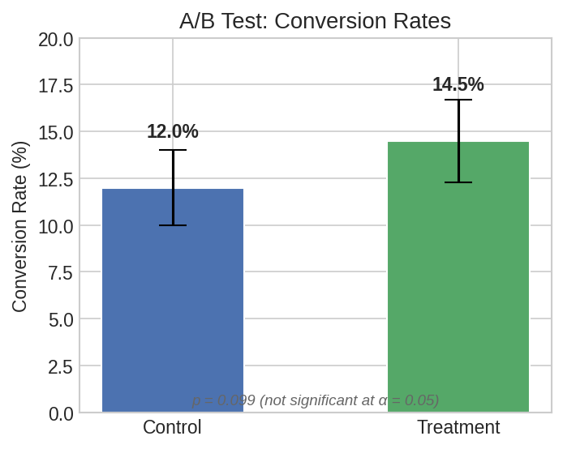
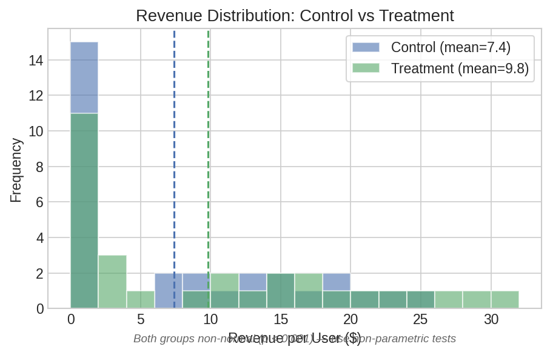
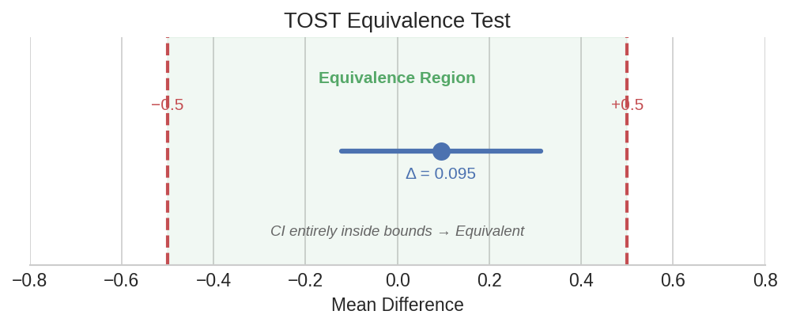
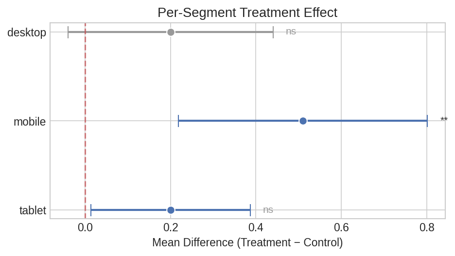

# A/B Testing

Practical examples for comparing variants in experiments: proportion tests, continuous metrics, equivalence testing, and per-segment analysis.

## Conversion Rate Comparison

The most common A/B test — did variant B improve the conversion rate?

```python
import polars as pl
import polars_statistics as ps

# Experiment results: 1000 users per variant
control_conversions = 120
control_n = 1000
treatment_conversions = 145
treatment_n = 1000

result = pl.select(
    ps.prop_test_two(
        successes1=treatment_conversions, n1=treatment_n,
        successes2=control_conversions, n2=control_n,
    ).alias("prop_test")
)

pt = result["prop_test"][0]
print(f"Treatment rate: {treatment_conversions/treatment_n:.1%}")
print(f"Control rate:   {control_conversions/control_n:.1%}")
print(f"Difference:     {pt['estimate']:.4f}")
print(f"Chi²:           {pt['statistic']:.4f}")
print(f"p-value:        {pt['p_value']:.6f}")
```

Expected output:

```
Treatment rate: 14.5%
Control rate:   12.0%
Difference:     0.0250
Chi²:           2.7187
p-value:        0.099177
```



??? note "Plot code"

    ```python
    import matplotlib.pyplot as plt

    fig, ax = plt.subplots(figsize=(5, 4))
    groups = ["Control", "Treatment"]
    rates = [12.0, 14.5]
    ax.bar(groups, rates, color=["#4C72B0", "#55A868"], width=0.5,
           yerr=[[2.0, 2.2], [2.0, 2.2]], capsize=8)
    ax.set_ylabel("Conversion Rate (%)")
    ax.set_title("A/B Test: Conversion Rates")
    plt.tight_layout()
    plt.savefig("abt_conversion_rates.png", dpi=150)
    ```

### With Continuity Correction

For small sample sizes, apply Yates' correction:

```python
result = pl.select(
    ps.prop_test_two(
        successes1=15, n1=50,
        successes2=8, n2=50,
        correction=True,
    ).alias("prop_test")
)

pt = result["prop_test"][0]
print(f"Corrected Chi²: {pt['statistic']:.4f}")
print(f"p-value:         {pt['p_value']:.6f}")
```

Expected output:

```
Corrected Chi²: 2.0327
p-value:         0.153942
```

## Continuous Metric Comparison

Compare revenue per user across variants:

```python
df = pl.DataFrame({
    "control":   [12.5, 0, 8.3, 0, 15.2, 0, 22.1, 0, 9.8, 0,
                  18.4, 0, 7.6, 0, 25.3, 0, 11.0, 0, 14.7, 0,
                  0, 16.8, 0, 19.5, 0, 6.2, 0, 21.9, 0, 13.1],
    "treatment": [15.8, 0, 11.2, 0, 18.5, 3.2, 28.4, 0, 13.1, 0,
                  22.7, 0, 10.9, 5.1, 30.2, 0, 14.3, 0, 17.6, 0,
                  2.8, 20.1, 0, 24.8, 0, 9.5, 0, 26.3, 3.7, 16.4],
})

# Revenue data is typically skewed (many zeros) — check normality first
normality = df.select(
    ps.shapiro_wilk("control").alias("ctrl_norm"),
    ps.shapiro_wilk("treatment").alias("treat_norm"),
)

ctrl_p = normality["ctrl_norm"][0]["p_value"]
treat_p = normality["treat_norm"][0]["p_value"]
print(f"Control normality p={ctrl_p:.4f}, Treatment normality p={treat_p:.4f}")

# For skewed data, use non-parametric or robust tests
tests = df.select(
    ps.ttest_ind("treatment", "control").alias("ttest"),
    ps.mann_whitney_u("treatment", "control").alias("mwu"),
    ps.yuen_test("treatment", "control", trim=0.2).alias("yuen"),
)

for name in ["ttest", "mwu", "yuen"]:
    r = tests[name][0]
    print(f"{name:8s}: statistic={r['statistic']:.4f}, p={r['p_value']:.6f}")
```

Expected output:

```
Control normality p=0.0001, Treatment normality p=0.0009
ttest   : statistic=0.9932, p=0.324853
mwu     : statistic=517.0000, p=0.305012
yuen    : statistic=0.7505, p=0.458257
```



??? note "Plot code"

    ```python
    import matplotlib.pyplot as plt
    import numpy as np

    fig, ax = plt.subplots(figsize=(7, 4))
    bins = np.linspace(0, 32, 17)
    ax.hist(df["control"].to_list(), bins=bins, alpha=0.6,
            label="Control", color="#4C72B0")
    ax.hist(df["treatment"].to_list(), bins=bins, alpha=0.6,
            label="Treatment", color="#55A868")
    ax.axvline(df["control"].mean(), color="#4C72B0", ls="--", lw=1.5)
    ax.axvline(df["treatment"].mean(), color="#55A868", ls="--", lw=1.5)
    ax.set_xlabel("Revenue per User ($)")
    ax.set_ylabel("Frequency")
    ax.legend()
    plt.tight_layout()
    plt.savefig("abt_revenue_distributions.png", dpi=150)
    ```

## Equivalence Testing (TOST)

Standard tests ask "is there a difference?" — TOST asks "are these practically equivalent?"

This is critical for non-inferiority trials, platform migrations, and guardrail metrics.

### Proportion Equivalence

After redesigning the checkout flow, verify the new conversion rate is equivalent to the old one within 2 percentage points:

```python
result = pl.select(
    ps.tost_prop_two(
        successes1=482, n1=1000,   # new design
        successes2=475, n2=1000,   # old design
        delta=0.02,                # equivalence margin: ±2%
    ).alias("tost")
)

tost = result["tost"][0]
print(f"Difference: {tost['estimate']:.4f}")
print(f"TOST p:     {tost['tost_p_value']:.6f}")
print(f"Equivalent: {tost['equivalent']}")
# equivalent=True → new design conversion rate is within ±2% of old
```

Expected output:

```
Difference: 0.0070
TOST p:     0.280307
Equivalent: False
```

### Mean Equivalence

Test whether two variants produce equivalent average session duration:

```python
df_duration = pl.DataFrame({
    "variant_a": [5.2, 4.8, 6.1, 5.5, 4.9, 5.8, 5.3, 6.0, 5.1, 4.7,
                  5.6, 5.0, 5.9, 5.4, 4.6, 5.7, 5.2, 6.2, 5.3, 4.8],
    "variant_b": [5.0, 5.1, 5.8, 5.3, 5.2, 5.5, 5.1, 5.7, 4.9, 5.0,
                  5.4, 5.2, 5.6, 5.1, 4.8, 5.3, 5.0, 5.9, 5.2, 5.1],
})

# Standard two-sample TOST
tost_result = df_duration.select(
    ps.tost_t_test_two_sample("variant_a", "variant_b", delta=0.5).alias("tost")
)

tost = tost_result["tost"][0]
print(f"Mean difference: {tost['estimate']:.4f}")
print(f"CI: [{tost['ci_lower']:.4f}, {tost['ci_upper']:.4f}]")
print(f"TOST p-value:    {tost['tost_p_value']:.6f}")
print(f"Equivalent:      {tost['equivalent']}")
```

Expected output:

```
Mean difference: 0.0950
CI: [-0.1213, 0.3113]
TOST p-value:    0.001671
Equivalent:      True
```



??? note "Plot code"

    ```python
    import matplotlib.pyplot as plt

    fig, ax = plt.subplots(figsize=(8, 2.5))
    delta = 0.5
    ax.axvline(-delta, color="#C44E52", ls="--", lw=2)
    ax.axvline(delta, color="#C44E52", ls="--", lw=2)
    ax.axvspan(-delta, delta, alpha=0.08, color="#55A868")
    ax.plot([-0.1213, 0.3113], [0.5, 0.5], color="#4C72B0", lw=3)
    ax.plot(0.095, 0.5, "o", color="#4C72B0", ms=10)
    ax.set_xlabel("Mean Difference")
    ax.set_title("TOST Equivalence Test")
    ax.set_yticks([])
    plt.tight_layout()
    plt.savefig("abt_tost_diagram.png", dpi=150)
    ```

### Using Cohen's d Bounds

When you don't have a natural equivalence margin, use effect size:

```python
tost_cohen = df_duration.select(
    ps.tost_t_test_two_sample(
        "variant_a", "variant_b",
        bounds_type="cohen_d", delta=0.3,  # small effect size threshold
    ).alias("tost")
)

tost = tost_cohen["tost"][0]
print(f"Equivalent (d < 0.3): {tost['equivalent']}")
```

Expected output:

```
Equivalent (d < 0.3): False
```

### Comparing Traditional Test vs TOST

Run both side-by-side to illustrate the difference:

```python
both = df_duration.select(
    ps.ttest_ind("variant_a", "variant_b").alias("traditional"),
    ps.tost_t_test_two_sample("variant_a", "variant_b", delta=0.5).alias("equivalence"),
)

trad = both["traditional"][0]
equiv = both["equivalence"][0]

print(f"Traditional t-test:  p={trad['p_value']:.4f}")
print(f"  → {'Significant' if trad['p_value'] < 0.05 else 'Not significant'} difference")
print(f"TOST equivalence:    p={equiv['tost_p_value']:.4f}")
print(f"  → {'Equivalent' if equiv['equivalent'] else 'Not equivalent'} within ±0.5")
# A non-significant t-test does NOT prove equivalence — that's what TOST is for.
```

Expected output:

```
Traditional t-test:  p=0.4624
  → Not significant difference
TOST equivalence:    p=0.0017
  → Equivalent within ±0.5
```

## Per-Segment A/B Analysis

Run the same test across multiple user segments using `group_by`:

```python
df_segments = pl.DataFrame({
    "segment":   (["mobile"] * 20) + (["desktop"] * 20) + (["tablet"] * 20),
    "control":   [3.2, 4.1, 2.8, 3.5, 4.0, 3.1, 3.8, 2.9, 4.2, 3.6,
                  3.3, 3.9, 2.7, 4.3, 3.4, 3.0, 4.1, 3.7, 2.6, 3.5,
                  5.1, 6.2, 5.8, 6.5, 5.3, 6.0, 5.7, 6.3, 5.5, 6.1,
                  5.9, 5.4, 6.4, 5.2, 6.6, 5.6, 6.0, 5.8, 6.2, 5.3,
                  4.0, 4.5, 3.8, 4.7, 4.2, 3.9, 4.6, 4.1, 4.8, 4.3,
                  4.4, 3.7, 4.9, 4.0, 4.6, 4.2, 4.3, 3.8, 4.5, 4.1],
    "treatment": [3.8, 4.5, 3.2, 4.0, 4.6, 3.7, 4.3, 3.4, 4.8, 4.1,
                  3.9, 4.4, 3.1, 4.9, 3.8, 3.5, 4.7, 4.2, 3.0, 4.0,
                  5.3, 6.4, 6.0, 6.7, 5.5, 6.2, 5.9, 6.5, 5.7, 6.3,
                  6.1, 5.6, 6.6, 5.4, 6.8, 5.8, 6.2, 6.0, 6.4, 5.5,
                  4.2, 4.7, 4.0, 4.9, 4.4, 4.1, 4.8, 4.3, 5.0, 4.5,
                  4.6, 3.9, 5.1, 4.2, 4.8, 4.4, 4.5, 4.0, 4.7, 4.3],
})

segment_results = (
    df_segments.group_by("segment")
    .agg(
        ps.ttest_ind("treatment", "control").alias("ttest"),
        ps.tost_t_test_two_sample("treatment", "control", delta=0.5).alias("tost"),
    )
    .sort("segment")
    .with_columns(
        pl.col("ttest").struct.field("statistic").alias("t_stat"),
        pl.col("ttest").struct.field("p_value").alias("p_value"),
        pl.col("tost").struct.field("equivalent").alias("equivalent"),
    )
    .select("segment", "t_stat", "p_value", "equivalent")
)

print(segment_results)
# ┌─────────┬──────────┬──────────┬────────────┐
# │ segment ┆ t_stat   ┆ p_value  ┆ equivalent │
# ╞═════════╪══════════╪══════════╪════════════╡
# │ desktop ┆ 1.4051   ┆ 0.168117 ┆ true       │
# │ mobile  ┆ 2.9529   ┆ 0.005388 ┆ false      │
# │ tablet  ┆ 1.8092   ┆ 0.078344 ┆ true       │
# └─────────┴──────────┴──────────┴────────────┘
```



??? note "Plot code"

    ```python
    import matplotlib.pyplot as plt
    import numpy as np

    # Compute per-segment mean differences and CIs from TOST results
    segments = segment_results["segment"].to_list()
    tost_data = segment_results.with_columns(
        pl.col("tost").struct.field("estimate").alias("est"),
        pl.col("tost").struct.field("ci_lower").alias("ci_lo"),
        pl.col("tost").struct.field("ci_upper").alias("ci_hi"),
    )

    fig, ax = plt.subplots(figsize=(7, 3.5))
    for i, row in enumerate(tost_data.iter_rows(named=True)):
        ax.errorbar(row["est"], i,
                    xerr=[[row["est"] - row["ci_lo"]], [row["ci_hi"] - row["est"]]],
                    fmt="o", ms=8, capsize=6, lw=2,
                    color="#4C72B0" if row["ci_lo"] > 0 else "#999")
    ax.axvline(0, color="#C44E52", ls="--", lw=1.5, alpha=0.7)
    ax.set_yticks(range(len(segments)))
    ax.set_yticklabels(segments)
    ax.set_xlabel("Mean Difference (Treatment − Control)")
    ax.invert_yaxis()
    plt.tight_layout()
    plt.savefig("abt_segment_forest.png", dpi=150)
    ```

## Categorical Outcomes

### Chi-Square Test of Independence

Test whether conversion depends on the variant:

```python
# Contingency table (row-major flattened):
#              Converted  Not Converted
# Control:       120         880
# Treatment:     145         855
counts = pl.DataFrame({
    "counts": [120, 880, 145, 855]
})

result = counts.select(
    ps.chisq_test("counts", n_rows=2, n_cols=2).alias("chisq")
)

chi = result["chisq"][0]
print(f"Chi²:    {chi['statistic']:.4f}")
print(f"p-value: {chi['p_value']:.6f}")
print(f"df:      {chi['df']}")

# Effect size
effect = counts.select(
    ps.cramers_v("counts", n_rows=2, n_cols=2).alias("v")
)
v = effect["v"][0]
print(f"Cramér's V: {v['estimate']:.4f}")
# V < 0.1 = negligible, 0.1-0.3 = small, 0.3-0.5 = medium, > 0.5 = large
```

Expected output:

```
Chi²:    2.7187
p-value: 0.099177
df:      1.0
Cramér's V: 0.0369
```

### Fisher's Exact Test

For small samples where chi-square approximation is unreliable:

```python
# Small pilot study
#              Success  Failure
# Treatment:     8        2
# Control:       3        7
result = pl.select(
    ps.fisher_exact(a=8, b=2, c=3, d=7).alias("fisher")
)

f = result["fisher"][0]
print(f"Odds ratio: {f['statistic']:.4f}")
print(f"p-value:    {f['p_value']:.6f}")
```

Expected output:

```
Odds ratio: 9.3333
p-value:    0.069779
```
