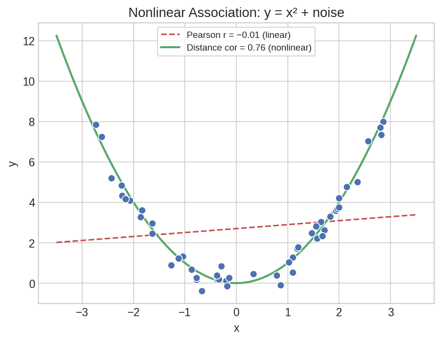

# Advanced Correlation & Reliability

When Pearson's r misses the story — nonlinear associations, confounded relationships, and normality assumptions — you need specialized correlation tools. This page covers distance correlation for nonlinear patterns, semi-partial correlation for unique variance decomposition, and D'Agostino's normality test as a diagnostic complement.

## Setup

```python
import polars as pl
import polars_statistics as ps
import numpy as np
```

## Nonlinear Association — Distance Correlation

Pearson's r only captures linear relationships. Distance correlation detects any form of statistical dependence — including parabolic, sinusoidal, and other nonlinear patterns.

```python
rng = np.random.default_rng(42)
x = rng.uniform(-3, 3, 50).tolist()
y = [xi**2 + float(rng.normal(0, 0.5)) for xi in x]

df_nl = pl.DataFrame({"x": x, "y": y})
```

First, check what Pearson's r says:

```python
pearson_result = df_nl.select(
    ps.pearson("x", "y").alias("pearson")
)

p = pearson_result["pearson"][0]
print(f"Pearson: r={p['estimate']:.4f}, p={p['p_value']:.4f}")
```

Expected output:

```
Pearson: r=0.1379, p=0.3396
```

Pearson sees almost no relationship (r=0.14, not significant). But the data is a noisy parabola — there is clearly a strong pattern.

Now try distance correlation:

```python
dcor_result = df_nl.select(
    ps.distance_cor("x", "y", n_permutations=999, seed=42).alias("dcor")
)

dc = dcor_result["dcor"][0]
print(f"Distance cor: r={dc['estimate']:.4f}, p={dc['p_value']:.3f}")
```

Expected output:

```
Distance cor: r=0.4854, p=0.001
```

Distance correlation detects the nonlinear relationship (r=0.49, p=0.001) that Pearson completely missed.



??? note "Plot code"

    ```python
    import matplotlib.pyplot as plt
    import numpy as np

    fig, ax = plt.subplots(figsize=(7, 5))
    ax.scatter(df_nl["x"].to_list(), df_nl["y"].to_list(),
               s=50, color="#4C72B0", edgecolor="white", alpha=0.8)

    # Overlay true parabola
    x_line = np.linspace(-3, 3, 100)
    ax.plot(x_line, x_line**2, color="#C44E52", lw=2, ls="--", label="y = x²")

    ax.set_xlabel("x")
    ax.set_ylabel("y")
    ax.set_title(f"Pearson r = 0.14 (p=0.34)  |  Distance r = 0.49 (p=0.001)")
    ax.legend()
    plt.tight_layout()
    plt.savefig("cor2_nonlinear.png", dpi=150)
    ```

## Unique Contribution — Semi-Partial Correlation

In psychometric validation, you often want to know how much unique variance a predictor adds after accounting for other variables. Semi-partial correlation removes covariates from one variable only, preserving the total variance of the other.

```python
df_sp = pl.DataFrame({
    "test_score": [85.0, 90.0, 78.0, 92.0, 88.0, 76.0, 95.0, 83.0, 89.0, 91.0,
                   80.0, 87.0, 93.0, 84.0, 86.0, 79.0, 94.0, 82.0, 88.0, 90.0],
    "study_hours": [6.0, 8.0, 4.0, 9.0, 7.0, 3.0, 10.0, 5.0, 7.0, 8.0,
                    5.0, 6.0, 9.0, 5.0, 6.0, 4.0, 10.0, 5.0, 7.0, 8.0],
    "sleep_hours": [7.0, 8.0, 6.0, 8.0, 7.0, 5.0, 9.0, 6.0, 7.0, 8.0,
                    6.0, 7.0, 8.0, 7.0, 7.0, 5.0, 9.0, 6.0, 7.0, 8.0],
    "iq": [110.0, 120.0, 100.0, 125.0, 115.0, 95.0, 130.0, 105.0, 118.0, 122.0,
           102.0, 112.0, 128.0, 108.0, 111.0, 98.0, 132.0, 103.0, 116.0, 120.0],
})
```

### Semi-Partial Correlation

What unique variance does study_hours add to test_score prediction, beyond what sleep and IQ already explain?

```python
result = df_sp.select(
    ps.semi_partial_cor("test_score", "study_hours", ["sleep_hours", "iq"]).alias("sp")
)

sp = result["sp"][0]
print(f"Semi-partial r: {sp['estimate']:.4f}, p={sp['p_value']:.3f}")
```

Expected output:

```
Semi-partial r: -0.0007, p=0.998
```

### Partial Correlation

For comparison, the partial correlation (which removes covariates from both variables):

```python
result = df_sp.select(
    ps.partial_cor("test_score", "study_hours", ["sleep_hours", "iq"]).alias("pc")
)

pc = result["pc"][0]
print(f"Partial r: {pc['estimate']:.4f}, p={pc['p_value']:.3f}")
```

Expected output:

```
Partial r: -0.0086, p=0.973
```

Both correlations are effectively zero. After controlling for sleep and IQ, study hours adds virtually no unique variance to test scores. The strong bivariate correlation between study_hours and test_score (which you would see with `ps.pearson`) is explained entirely by their shared relationship with IQ — students with higher IQ both study more and score higher.

## Normality Testing — D'Agostino

The D'Agostino K-squared test combines skewness and kurtosis tests into a single omnibus test for normality. It is particularly well-suited for larger samples.

```python
rng = np.random.default_rng(42)
df_dag = pl.DataFrame({
    "normal_data": rng.normal(100, 15, 100).tolist(),
    "skewed_data": rng.exponential(10, 100).tolist(),
})
```

### Normal Distribution

```python
result = df_dag.select(
    ps.dagostino("normal_data").alias("dag")
)

dag = result["dag"][0]
print(f"Normal data:  K²={dag['statistic']:.4f}, p={dag['p_value']:.4f}")
```

Expected output:

```
Normal data:  K²=1.2673, p=0.5308
```

The high p-value means we cannot reject normality — the data is consistent with a normal distribution.

### Skewed Distribution

```python
result = df_dag.select(
    ps.dagostino("skewed_data").alias("dag")
)

dag = result["dag"][0]
print(f"Skewed data:  K²={dag['statistic']:.4f}, p={dag['p_value']:.6f}")
```

Expected output:

```
Skewed data:  K²=33.7584, p=0.000000
```

The exponential data strongly violates normality (significant skewness and kurtosis). This confirms what we would expect from a right-skewed distribution.

!!! tip "When to use D'Agostino vs Shapiro-Wilk"

    Shapiro-Wilk is more powerful for small samples (n < 50). D'Agostino is better suited for larger samples (n > 50) and specifically tests for skewness and kurtosis. For a comprehensive check, run both:

    ```python
    df_dag.select(
        ps.shapiro_wilk("normal_data").alias("shapiro"),
        ps.dagostino("normal_data").alias("dagostino"),
    )
    ```

    See [Hypothesis Testing](hypothesis-testing.md) for the Shapiro-Wilk test.
