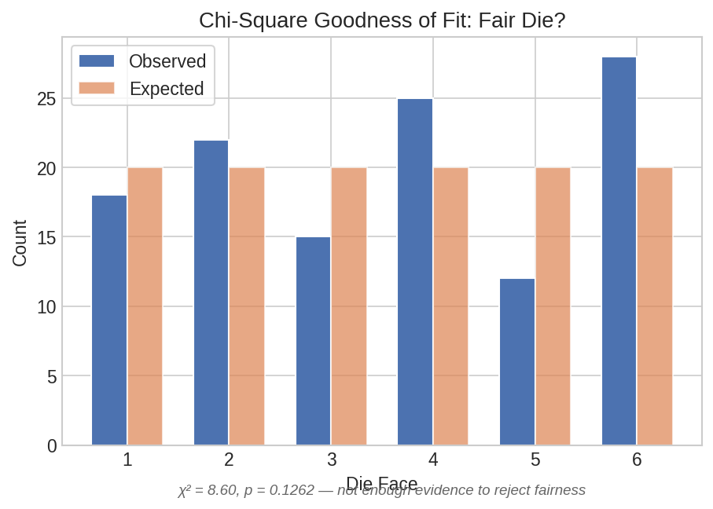
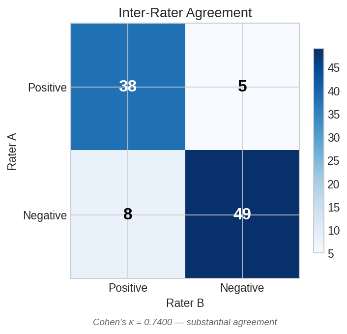

# Categorical Data Analysis

Statistical methods for count data, contingency tables, and inter-rater agreement — the bread and butter of survey analysis, quality control, and clinical diagnostics.

## Setup

```python
import polars as pl
import polars_statistics as ps
```

## Single Proportion Tests

A survey finds 58 out of 100 respondents prefer the new design. Is this significantly different from 50%?

### Exact Binomial Test

```python
result = pl.select(
    ps.binom_test(successes=58, n=100, p0=0.5).alias("binom")
)

b = result["binom"][0]
print(f"Estimate:  {b['estimate']:.2f}")
print(f"Statistic: {b['statistic']:.2f}")
print(f"p-value:   {b['p_value']:.3f}")
print(f"CI: [{b['ci_lower']:.3f}, {b['ci_upper']:.3f}]")
```

Expected output:

```
Estimate:  0.58
Statistic: 0.58
p-value:   0.133
CI: [0.497, 0.670]
```

### Normal Approximation (Z-test)

```python
result = pl.select(
    ps.prop_test_one(successes=58, n=100, p0=0.5).alias("prop")
)

p = result["prop"][0]
print(f"Estimate:  {p['estimate']:.2f}")
print(f"Statistic: {p['statistic']:.2f}")
print(f"p-value:   {p['p_value']:.3f}")
print(f"CI: [{p['ci_lower']:.3f}, {p['ci_upper']:.3f}]")
```

Expected output:

```
Estimate:  0.58
Statistic: 1.60
p-value:   0.110
CI: [0.482, 0.672]
```

Neither test rejects the null at alpha=0.05. The 58% preference is not statistically distinguishable from 50%, though the confidence interval suggests the true preference could be anywhere from about 48% to 67%.

## Goodness of Fit

A die is rolled 120 times. Are the results consistent with a fair die?

```python
observed = pl.DataFrame({"counts": [18, 22, 15, 25, 12, 28]})

result = observed.select(
    ps.chisq_goodness_of_fit("counts").alias("gof")
)

gof = result["gof"][0]
print(f"Chi² statistic: {gof['statistic']:.2f}")
print(f"p-value:        {gof['p_value']:.3f}")
print(f"df:             {gof['df']}")
```

Expected output:

```
Chi² statistic: 9.30
p-value:        0.098
df:             5
```

At alpha=0.05, we cannot reject the null hypothesis of equal proportions — the die is consistent with fair. However, p=0.098 is borderline; a larger sample might reveal a real bias.



??? note "Plot code"

    ```python
    import matplotlib.pyplot as plt
    import numpy as np

    faces = ["1", "2", "3", "4", "5", "6"]
    obs = [18, 22, 15, 25, 12, 28]
    expected = [20] * 6

    x = np.arange(len(faces))
    w = 0.35
    fig, ax = plt.subplots(figsize=(7, 4))
    ax.bar(x - w/2, obs, w, label="Observed", color="#4C72B0")
    ax.bar(x + w/2, expected, w, label="Expected (fair)", color="#DD8452", alpha=0.7)
    ax.set_xticks(x)
    ax.set_xticklabels(faces)
    ax.set_xlabel("Die Face")
    ax.set_ylabel("Count")
    ax.set_title("Goodness of Fit: Die Fairness")
    ax.legend()
    plt.tight_layout()
    plt.savefig("cat_goodness_of_fit.png", dpi=150)
    ```

## Likelihood Ratio Test (G-Test)

The G-test is an alternative to Pearson's chi-square for contingency tables. Test independence in a 2x2 table:

```python
# Contingency table (row-major flattened):
#           Success  Failure
# Group A:    45       55
# Group B:    35       65
ct = pl.DataFrame({"counts": [45, 55, 35, 65]})

result = ct.select(
    ps.g_test("counts", n_rows=2, n_cols=2).alias("g")
)

g = result["g"][0]
print(f"G statistic: {g['statistic']:.3f}")
print(f"p-value:     {g['p_value']:.3f}")
print(f"df:          {g['df']}")
```

Expected output:

```
G statistic: 2.088
p-value:     0.149
df:          1
```

No significant association between group membership and outcome.

## Paired Proportions — McNemar's Test

Before and after a treatment, patients are classified as positive or negative. The off-diagonal cells measure change:

```python
# Contingency table:
#                After +   After -
# Before +:       40        15      (b=15 improved)
# Before -:        5        40      (c=5 worsened)
result = pl.select(
    ps.mcnemar_test(a=40, b=15, c=5, d=40).alias("mcnemar")
)

m = result["mcnemar"][0]
print(f"Chi² statistic: {m['statistic']:.1f}")
print(f"p-value:        {m['p_value']:.3f}")
print(f"df:             {m['df']}")
```

Expected output:

```
Chi² statistic: 5.0
p-value:        0.025
df:             1
```

Significant at alpha=0.05: the change from before to after is asymmetric — more patients improved (b=15) than worsened (c=5).

### McNemar's Exact Test

For small cell counts, use the exact binomial version:

```python
result = pl.select(
    ps.mcnemar_exact(a=40, b=15, c=5, d=40).alias("exact")
)

e = result["exact"][0]
print(f"Statistic: {e['statistic']:.1f}")
print(f"p-value:   {e['p_value']:.3f}")
```

Expected output:

```
Statistic: 20.0
p-value:   0.041
```

## Inter-Rater Agreement

Two raters independently classify 100 items into 3 categories. How well do they agree?

```python
# 3x3 confusion matrix (row-major flattened):
#           Rater B: Cat1  Cat2  Cat3
# Rater A: Cat1:     30     5     2
#          Cat2:      3    28     4
#          Cat3:      1     3    24
ratings = pl.DataFrame({"counts": [30, 5, 2, 3, 28, 4, 1, 3, 24]})

result = ratings.select(
    ps.cohen_kappa("counts", n_categories=3).alias("kappa")
)

k = result["kappa"][0]
print(f"Kappa:     {k['estimate']:.3f}")
print(f"SE:        {k['statistic']:.3f}")
print(f"p-value:   {k['p_value']:.6f}")
```

Expected output:

```
Kappa:     0.729
SE:        0.153
p-value:   0.000002
```

A kappa of 0.73 indicates substantial agreement (0.61-0.80 is "substantial" on the Landis-Koch scale).



??? note "Plot code"

    ```python
    import matplotlib.pyplot as plt
    import numpy as np

    matrix = np.array([[30, 5, 2], [3, 28, 4], [1, 3, 24]])
    categories = ["Cat 1", "Cat 2", "Cat 3"]

    fig, ax = plt.subplots(figsize=(5, 4.5))
    im = ax.imshow(matrix, cmap="Blues", aspect="auto")
    for i in range(3):
        for j in range(3):
            color = "white" if matrix[i, j] > 15 else "black"
            ax.text(j, i, str(matrix[i, j]), ha="center", va="center",
                    color=color, fontsize=14, fontweight="bold")
    ax.set_xticks(range(3))
    ax.set_xticklabels(categories)
    ax.set_yticks(range(3))
    ax.set_yticklabels(categories)
    ax.set_xlabel("Rater B")
    ax.set_ylabel("Rater A")
    ax.set_title(f"Inter-Rater Agreement (κ = 0.729)")
    fig.colorbar(im, ax=ax, shrink=0.8)
    plt.tight_layout()
    plt.savefig("cat_agreement_heatmap.png", dpi=150)
    ```

## Association Measures

### Phi Coefficient

For 2x2 tables, the phi coefficient measures the strength of association:

```python
result = pl.select(
    ps.phi_coefficient(a=45, b=55, c=35, d=65).alias("phi")
)

phi = result["phi"][0]
print(f"Phi: {phi['estimate']:.3f}")
```

Expected output:

```
Phi: 0.102
```

### Contingency Coefficient

```python
ct = pl.DataFrame({"counts": [45, 55, 35, 65]})

result = ct.select(
    ps.contingency_coef("counts", n_rows=2, n_cols=2).alias("cc")
)

cc = result["cc"][0]
print(f"Contingency coefficient: {cc['estimate']:.3f}")
```

Expected output:

```
Contingency coefficient: 0.102
```

Both measures indicate a very weak association (values below 0.1 are typically considered negligible).

!!! tip "Choosing the right association measure"

    - **Phi coefficient**: Only for 2x2 tables. Ranges from -1 to 1.
    - **Cramer's V**: Generalizes phi to larger tables. Always non-negative.
    - **Contingency coefficient**: Bounded above by a value less than 1 (depends on table size).

    See [A/B Testing](ab-testing.md) for chi-square test of independence, Cramer's V, and Fisher's exact test.
