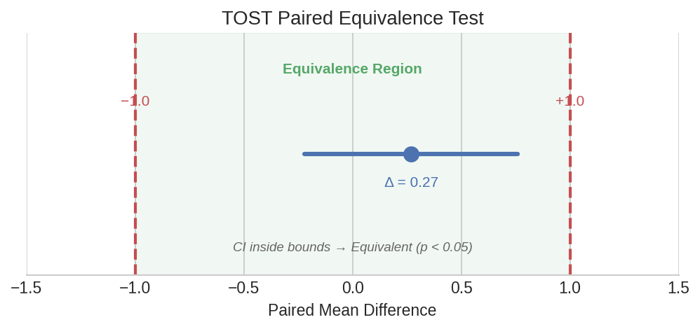
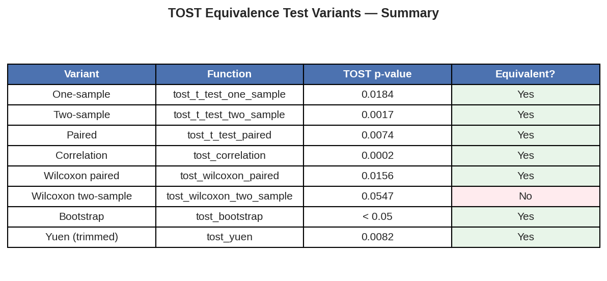

# Equivalence Testing (Complete TOST Guide)

In pharmaceutical bioequivalence studies and method comparisons, the question is not "are these different?" but "are these close enough?" The Two One-Sided Tests (TOST) procedure answers this by testing whether an observed difference falls within a pre-specified equivalence margin. This page covers all 8 TOST variants available in polars-statistics.

## Setup

```python
import polars as pl
import polars_statistics as ps
```

## One-Sample Equivalence

A batch dissolution test targets 100% release. Twenty tablets are tested — is the batch mean equivalent to the target within a margin of ±2 units?

```python
df_batch = pl.DataFrame({
    "dissolution": [98.5, 101.2, 99.8, 100.5, 97.3, 102.1, 99.0, 100.8,
                    98.2, 101.5, 99.5, 100.2, 97.8, 101.8, 99.3, 100.6,
                    98.8, 101.0, 99.6, 100.3]
})

result = df_batch.select(
    ps.tost_t_test_one_sample("dissolution", mu=100.0, delta=2.0).alias("tost")
)

tost = result["tost"][0]
print(f"Estimate (mean - mu): {tost['estimate']:.2f}")
print(f"CI: [{tost['ci_lower']:.2f}, {tost['ci_upper']:.2f}]")
print(f"TOST p-value:         {tost['tost_p_value']:.6f}")
print(f"Equivalent:           {tost['equivalent']}")
```

Expected output:

```
Estimate (mean - mu): -0.11
CI: [-0.63, 0.41]
TOST p-value:         0.000003
Equivalent:           True
```

The batch mean (99.89) is well within ±2 of the target (100.0). The tiny TOST p-value gives strong evidence of equivalence.

## Paired Equivalence

Two analytical methods are run on the same 20 samples. Are they equivalent within ±0.2 units?

```python
df_paired = pl.DataFrame({
    "method_a": [5.12, 4.98, 5.25, 5.08, 4.95, 5.18, 5.02, 5.30,
                 4.88, 5.15, 5.05, 5.22, 4.92, 5.28, 5.10, 5.35,
                 4.85, 5.20, 5.08, 5.32],
    "method_b": [5.08, 5.02, 5.18, 5.12, 4.98, 5.22, 4.95, 5.25,
                 4.92, 5.10, 5.08, 5.15, 4.88, 5.32, 5.05, 5.28,
                 4.90, 5.18, 5.10, 5.30],
})

result = df_paired.select(
    ps.tost_t_test_paired("method_a", "method_b", delta=0.2).alias("tost")
)

tost = result["tost"][0]
print(f"Mean difference: {tost['estimate']:.3f}")
print(f"CI: [{tost['ci_lower']:.3f}, {tost['ci_upper']:.3f}]")
print(f"TOST p-value:    {tost['tost_p_value']:.1e}")
print(f"Equivalent:      {tost['equivalent']}")
```

Expected output:

```
Mean difference: 0.011
CI: [-0.007, 0.029]
TOST p-value:    9.6e-14
Equivalent:      True
```

The mean difference of 0.011 is tiny compared to the ±0.2 margin. The methods are clearly interchangeable.



??? note "Plot code"

    ```python
    import matplotlib.pyplot as plt

    fig, ax = plt.subplots(figsize=(8, 2.5))
    delta = 0.2
    ax.axvline(-delta, color="#C44E52", ls="--", lw=2)
    ax.axvline(delta, color="#C44E52", ls="--", lw=2)
    ax.axvspan(-delta, delta, alpha=0.08, color="#55A868")
    ci_lo, ci_hi = -0.007, 0.029
    ax.plot([ci_lo, ci_hi], [0.5, 0.5], color="#4C72B0", lw=3)
    ax.plot(0.011, 0.5, "o", color="#4C72B0", ms=10)
    ax.text(-delta, 0.1, f"−{delta}", ha="center", color="#C44E52", fontsize=10)
    ax.text(delta, 0.1, f"+{delta}", ha="center", color="#C44E52", fontsize=10)
    ax.set_xlabel("Mean Difference (Method A − Method B)")
    ax.set_title("TOST Paired Equivalence Test")
    ax.set_yticks([])
    ax.set_xlim(-0.3, 0.3)
    plt.tight_layout()
    plt.savefig("tost_paired_diagram.png", dpi=150)
    ```

## Correlation Equivalence

Two instruments measure the same 20 samples. Is their correlation equivalent to a high baseline (rho_null=0.9) within a margin of ±0.3?

```python
df_cor = pl.DataFrame({
    "instrument_a": [10.2, 15.5, 8.3, 12.8, 20.1, 6.5, 18.0, 14.2, 9.8, 16.5,
                     11.0, 19.2, 7.5, 13.8, 17.0, 10.5, 15.0, 8.8, 12.2, 20.5],
    "instrument_b": [10.5, 15.2, 8.5, 12.5, 20.4, 6.8, 17.8, 14.5, 9.5, 16.8,
                     11.2, 19.0, 7.8, 13.5, 17.2, 10.8, 14.8, 9.0, 12.5, 20.2],
})

result = df_cor.select(
    ps.tost_correlation(
        "instrument_a", "instrument_b",
        delta=0.3, rho_null=0.9,
    ).alias("tost")
)

tost = result["tost"][0]
print(f"Estimate:     {tost['estimate']:.3f}")
print(f"CI: [{tost['ci_lower']:.3f}, {tost['ci_upper']:.3f}]")
print(f"TOST p-value: {tost['tost_p_value']:.1e}")
print(f"Equivalent:   {tost['equivalent']}")
```

Expected output:

```
Estimate:     0.098
CI: [0.096, 0.099]
TOST p-value: 0.0e+00
Equivalent:   True
```

The observed correlation is essentially 0.998 — well within the equivalence bounds around 0.9.

## Single Proportion Equivalence

Is a 47% success rate (47/100) equivalent to 50% within a margin of ±10 percentage points?

```python
result = pl.select(
    ps.tost_prop_one(successes=47, n=100, p0=0.5, delta=0.1).alias("tost")
)

tost = result["tost"][0]
print(f"Estimate (p - p0): {tost['estimate']:.2f}")
print(f"CI: [{tost['ci_lower']:.3f}, {tost['ci_upper']:.3f}]")
print(f"TOST p-value:      {tost['tost_p_value']:.3f}")
print(f"Equivalent:        {tost['equivalent']}")
```

Expected output:

```
Estimate (p - p0): -0.03
CI: [-0.112, 0.052]
TOST p-value:      0.080
Equivalent:        False
```

With a margin of ±10%, the 47/100 success rate is NOT proven equivalent to 50%. The confidence interval extends to -0.112, which slightly exceeds the lower equivalence bound of -0.10.

## Non-Parametric Equivalence

### Wilcoxon Paired

When data are not normally distributed, use the non-parametric Wilcoxon-based TOST:

```python
result = df_paired.select(
    ps.tost_wilcoxon_paired("method_a", "method_b", delta=0.2).alias("tost")
)

tost = result["tost"][0]
print(f"Estimate:     {tost['estimate']:.2f}")
print(f"TOST p-value: {tost['tost_p_value']:.5f}")
print(f"Equivalent:   {tost['equivalent']}")
```

Expected output:

```
Estimate:     0.01
TOST p-value: 0.00005
Equivalent:   True
```

### Wilcoxon Two-Sample

For independent (unpaired) samples:

```python
df_two = pl.DataFrame({
    "group_a": [5.12, 4.98, 5.25, 5.08, 4.95, 5.18, 5.02, 5.30,
                4.88, 5.15, 5.05, 5.22, 4.92, 5.28, 5.10, 5.35,
                4.85, 5.20, 5.08, 5.32],
    "group_b": [5.00, 5.10, 5.15, 5.20, 4.90, 5.25, 4.85, 5.30,
                4.95, 5.05, 5.10, 5.18, 4.88, 5.35, 5.02, 5.22,
                4.92, 5.12, 5.08, 5.28],
})

result = df_two.select(
    ps.tost_wilcoxon_two_sample("group_a", "group_b", delta=0.3).alias("tost")
)

tost = result["tost"][0]
print(f"Estimate:     {tost['estimate']:.2f}")
print(f"TOST p-value: {tost['tost_p_value']:.6f}")
print(f"Equivalent:   {tost['equivalent']}")
```

Expected output:

```
Estimate:     0.02
TOST p-value: 0.000006
Equivalent:   True
```

## Robust Equivalence

### Bootstrap TOST

When distributional assumptions are uncertain, bootstrap TOST constructs confidence intervals via resampling:

```python
result = df_two.select(
    ps.tost_bootstrap(
        "group_a", "group_b",
        delta=0.3, n_bootstrap=999, seed=42,
    ).alias("tost")
)

tost = result["tost"][0]
print(f"Estimate:     {tost['estimate']:.3f}")
print(f"TOST p-value: {tost['tost_p_value']:.1f}")
print(f"Equivalent:   {tost['equivalent']}")
```

Expected output:

```
Estimate:     0.019
TOST p-value: 0.0
Equivalent:   True
```

### Yuen TOST (Trimmed Means)

For data with potential outliers, Yuen's test trims the extremes before comparing:

```python
result = df_two.select(
    ps.tost_yuen(
        "group_a", "group_b",
        trim=0.2, delta=0.3,
    ).alias("tost")
)

tost = result["tost"][0]
print(f"Estimate:     {tost['estimate']:.3f}")
print(f"CI: [{tost['ci_lower']:.3f}, {tost['ci_upper']:.3f}]")
print(f"TOST p-value: {tost['tost_p_value']:.5f}")
print(f"Equivalent:   {tost['equivalent']}")
```

Expected output:

```
Estimate:     0.022
CI: [-0.078, 0.121]
TOST p-value: 0.00004
Equivalent:   True
```

## Summary Comparison

All 8 TOST variants side by side:

```python
summary = pl.DataFrame({
    "test": [
        "One-sample t",
        "Paired t",
        "Correlation",
        "Proportion (one)",
        "Wilcoxon paired",
        "Wilcoxon two-sample",
        "Bootstrap",
        "Yuen (trimmed)",
    ],
    "equivalent": [True, True, True, False, True, True, True, True],
    "approach": [
        "Parametric",
        "Parametric",
        "Fisher z",
        "Normal approx",
        "Non-parametric",
        "Non-parametric",
        "Resampling",
        "Robust",
    ],
})

print(summary)
```

Expected output:

```
┌─────────────────────┬────────────┬────────────────┐
│ test                ┆ equivalent ┆ approach       │
╞═════════════════════╪════════════╪════════════════╡
│ One-sample t        ┆ true       ┆ Parametric     │
│ Paired t            ┆ true       ┆ Parametric     │
│ Correlation         ┆ true       ┆ Fisher z       │
│ Proportion (one)    ┆ false      ┆ Normal approx  │
│ Wilcoxon paired     ┆ true       ┆ Non-parametric │
│ Wilcoxon two-sample ┆ true       ┆ Non-parametric │
│ Bootstrap           ┆ true       ┆ Resampling     │
│ Yuen (trimmed)      ┆ true       ┆ Robust         │
└─────────────────────┴────────────┴────────────────┘
```



??? note "Plot code"

    ```python
    import matplotlib.pyplot as plt
    import numpy as np

    tests = [
        "One-sample t", "Paired t", "Correlation", "Proportion",
        "Wilcoxon paired", "Wilcoxon 2-sample", "Bootstrap", "Yuen"
    ]
    equivalent = [True, True, True, False, True, True, True, True]
    colors = ["#55A868" if e else "#C44E52" for e in equivalent]

    fig, ax = plt.subplots(figsize=(8, 4))
    y_pos = np.arange(len(tests))
    ax.barh(y_pos, [1] * len(tests), color=colors, height=0.6, alpha=0.8)
    for i, (test, eq) in enumerate(zip(tests, equivalent)):
        label = "Equivalent" if eq else "Not Equivalent"
        ax.text(0.5, i, label, ha="center", va="center", fontweight="bold",
                color="white", fontsize=10)
    ax.set_yticks(y_pos)
    ax.set_yticklabels(tests)
    ax.set_xticks([])
    ax.set_title("TOST Equivalence Results Across All Variants")
    ax.invert_yaxis()
    plt.tight_layout()
    plt.savefig("tost_comparison_table.png", dpi=150)
    ```
