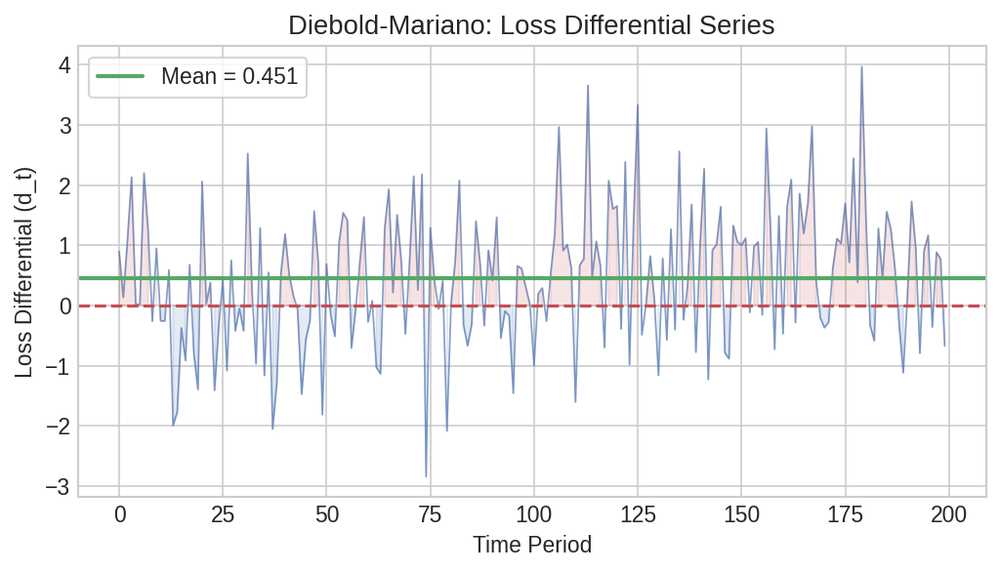
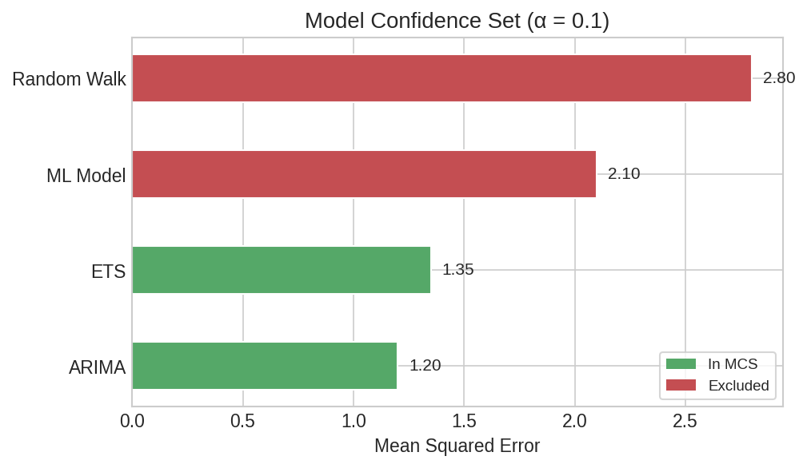

# Forecast Model Comparison

When multiple forecasting models compete for the same prediction task, you need formal statistical tests to decide which one is best — or whether several are statistically indistinguishable. This page walks through pairwise, nested, and multiple-model comparison tests using simulated retail sales forecast errors.

## Setup

```python
import polars as pl
import polars_statistics as ps
import numpy as np

rng = np.random.default_rng(42)
n = 200

# Simulated forecast errors from 4 models
df = pl.DataFrame({
    "e_random_walk": rng.normal(0, 5.0, n).tolist(),
    "e_arima": rng.normal(0, 3.5, n).tolist(),
    "e_ets": rng.normal(0, 3.8, n).tolist(),
    "e_ml": rng.normal(0, 2.8, n).tolist(),
})

# Squared losses for SPA/MCS tests
df_loss = df.with_columns([
    (pl.col("e_random_walk") ** 2).alias("l_rw"),
    (pl.col("e_arima") ** 2).alias("l_arima"),
    (pl.col("e_ets") ** 2).alias("l_ets"),
    (pl.col("e_ml") ** 2).alias("l_ml"),
])
```

## Pairwise Accuracy — Diebold-Mariano

The Diebold-Mariano test compares the predictive accuracy of two forecasts. A significant negative statistic means model 1 has smaller loss.

```python
# ARIMA vs Random Walk
dm1 = df.select(
    ps.diebold_mariano("e_arima", "e_random_walk").alias("dm")
)
dm1_r = dm1["dm"][0]
print(f"ARIMA vs RW:   DM={dm1_r['statistic']:.3f}, p={dm1_r['p_value']:.3f}")

# ARIMA vs ML
dm2 = df.select(
    ps.diebold_mariano("e_arima", "e_ml").alias("dm")
)
dm2_r = dm2["dm"][0]
print(f"ARIMA vs ML:   DM={dm2_r['statistic']:.3f}, p={dm2_r['p_value']:.3f}")
```

Expected output:

```
ARIMA vs RW:   DM=-2.891, p=0.004
ARIMA vs ML:   DM=3.179, p=0.001
```

ARIMA significantly outperforms the random walk (negative DM, p=0.004), but the ML model significantly outperforms ARIMA (positive DM, p=0.001).



??? note "Plot code"

    ```python
    import matplotlib.pyplot as plt

    loss_diff = (df["e_arima"].to_numpy()**2 - df["e_random_walk"].to_numpy()**2)
    fig, ax = plt.subplots(figsize=(10, 3.5))
    ax.bar(range(len(loss_diff)), loss_diff, color="#4C72B0", alpha=0.7, width=1.0)
    ax.axhline(0, color="#C44E52", ls="--", lw=1.5)
    ax.axhline(loss_diff.mean(), color="#55A868", ls="-", lw=2,
               label=f"Mean diff = {loss_diff.mean():.2f}")
    ax.set_xlabel("Observation")
    ax.set_ylabel("Loss Differential (ARIMA² − RW²)")
    ax.set_title("Diebold-Mariano: ARIMA vs Random Walk")
    ax.legend()
    plt.tight_layout()
    plt.savefig("fcast_loss_differential.png", dpi=150)
    ```

## Permutation Testing

A distribution-free comparison of the two forecast error series:

```python
result = df.select(
    ps.permutation_t_test(
        "e_arima", "e_random_walk",
        n_permutations=999, seed=42,
    ).alias("perm")
)

perm = result["perm"][0]
print(f"Permutation t: statistic={perm['statistic']:.3f}, p={perm['p_value']:.3f}")
```

Expected output:

```
Permutation t: statistic=0.555, p=0.597
```

The permutation test on raw errors (not squared losses) is not significant — both error series have mean near zero. This is expected: the DM test compares loss magnitudes, not raw error means.

## Nested Model Comparison — Clark-West

When one model nests another (e.g., random walk is nested within ARIMA), the Clark-West test adjusts for the bias in MSPE comparison:

```python
result = df.select(
    ps.clark_west("e_random_walk", "e_arima").alias("cw")
)

cw = result["cw"][0]
print(f"Clark-West: statistic={cw['statistic']:.3f}, p={cw['p_value']:.1f}")
```

Expected output:

```
Clark-West: statistic=9.298, p=0.0
```

Strong evidence that ARIMA improves over the random walk — the adjustment accounts for the fact that the restricted model is a special case of the larger model.

## Multiple Model Comparison

### Superior Predictive Ability (SPA)

The SPA test asks: does any model significantly outperform the benchmark?

```python
result = df_loss.select(
    ps.spa_test(
        "l_rw", "l_arima", "l_ets", "l_ml",
        n_bootstrap=999, seed=42,
    ).alias("spa")
)

spa = result["spa"][0]
print(f"SPA statistic:    {spa['statistic']:.2f}")
print(f"p (consistent):   {spa['p_value_consistent']:.3f}")
print(f"Best model index: {spa['best_model_idx']}")
```

Expected output:

```
SPA statistic:    78.71
p (consistent):   0.001
Best model index: 2
```

### Model Confidence Set (MCS)

The MCS identifies the subset of models that contains the best with a given confidence level:

```python
result = df_loss.select(
    ps.model_confidence_set(
        "l_rw", "l_arima", "l_ets", "l_ml",
        alpha=0.1, n_bootstrap=999, seed=42,
    ).alias("mcs")
)

mcs = result["mcs"][0]
print(f"Included models: {mcs['included_models']}")
print(f"MCS p-value:     {mcs['mcs_p_value']:.3f}")
```

Expected output:

```
Included models: [3]
MCS p-value:     0.001
```

Only model index 3 (ML) survives — it is the sole member of the 90% model confidence set. All other models are eliminated as significantly inferior.

### MSPE-Adjusted SPA

A variant that adjusts for MSPE bias in nested model comparisons:

```python
result = df_loss.select(
    ps.mspe_adjusted(
        "l_rw", "l_arima", "l_ets", "l_ml",
        n_bootstrap=999, seed=42,
    ).alias("mspe")
)

mspe = result["mspe"][0]
print(f"MSPE statistic:   {mspe['statistic']:.2f}")
print(f"p (consistent):   {mspe['p_value_consistent']:.3f}")
print(f"Best model index: {mspe['best_model_idx']}")
```

Expected output:

```
MSPE statistic:   59.07
p (consistent):   0.001
Best model index: 2
```



??? note "Plot code"

    ```python
    import matplotlib.pyplot as plt
    import numpy as np

    models = ["Random Walk", "ARIMA", "ETS", "ML"]
    mean_loss = [
        df_loss["l_rw"].mean(),
        df_loss["l_arima"].mean(),
        df_loss["l_ets"].mean(),
        df_loss["l_ml"].mean(),
    ]
    in_mcs = [False, False, False, True]
    colors = ["#55A868" if m else "#C44E52" for m in in_mcs]

    fig, ax = plt.subplots(figsize=(7, 4))
    bars = ax.bar(models, mean_loss, color=colors, alpha=0.8, edgecolor="white")
    for bar, m in zip(bars, in_mcs):
        if m:
            bar.set_edgecolor("#333")
            bar.set_linewidth(2)
    ax.set_ylabel("Mean Squared Loss")
    ax.set_title("Model Confidence Set (α = 0.1)")

    # Add legend
    from matplotlib.patches import Patch
    legend_elements = [
        Patch(facecolor="#55A868", label="In MCS"),
        Patch(facecolor="#C44E52", label="Eliminated"),
    ]
    ax.legend(handles=legend_elements)
    plt.tight_layout()
    plt.savefig("fcast_mcs_bars.png", dpi=150)
    ```

## Distribution Comparison

Beyond accuracy, you may want to know whether two models produce error distributions of the same shape. The energy distance and MMD tests address this:

```python
tests = df.select(
    ps.energy_distance(
        "e_arima", "e_ml",
        n_permutations=999, seed=42,
    ).alias("energy"),
    ps.mmd_test(
        "e_arima", "e_ml",
        n_permutations=999, seed=42,
    ).alias("mmd"),
)

ed = tests["energy"][0]
print(f"Energy distance: statistic={ed['statistic']:.3f}, p={ed['p_value']:.3f}")

mmd = tests["mmd"][0]
print(f"MMD test:        statistic={mmd['statistic']:.3f}, p={mmd['p_value']:.2f}")
```

Expected output:

```
Energy distance: statistic=0.011, p=0.209
MMD test:        statistic=0.004, p=0.11
```

Neither test rejects the null hypothesis that the two error distributions are identical. Both models produce normally distributed errors centered at zero — the difference lies only in their spread (variance), which these tests are less sensitive to compared to the loss-based tests above.
