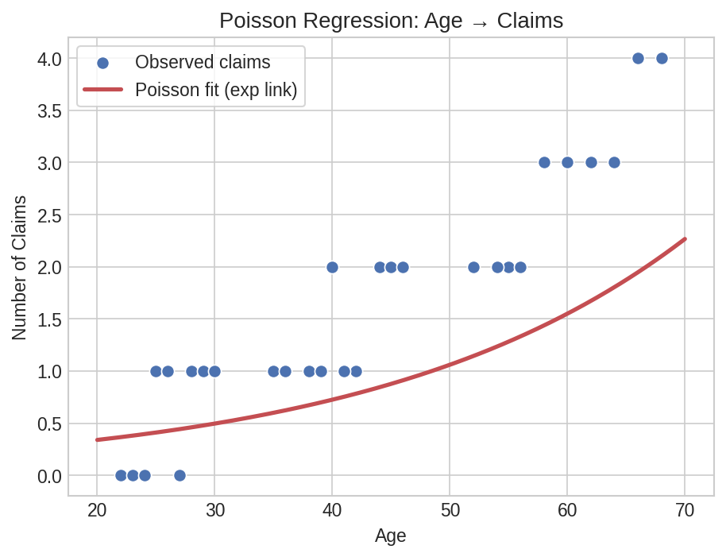
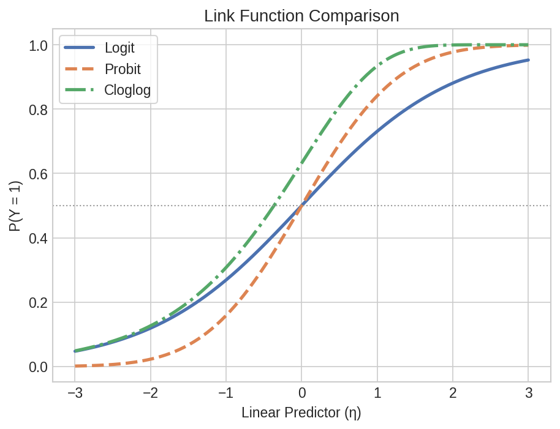

# Generalized Linear Models

Hospital admissions, insurance claims, and customer churn — real outcomes are often counts, binary flags, or skewed amounts rather than continuous normals. GLMs handle all of these by choosing the right link function and variance structure. This page walks through Poisson, Negative Binomial, Tweedie, Probit, and Complementary log-log models using polars-statistics.

## Setup

```python
import polars as pl
import polars_statistics as ps

# Insurance claims: age predicts number of claims (Poisson count data)
claims_df = pl.DataFrame({
    "claims": [0.0, 0.0, 1.0, 0.0, 1.0, 0.0, 1.0, 0.0, 1.0, 1.0,
               1.0, 1.0, 2.0, 1.0, 1.0, 2.0, 1.0, 2.0, 1.0, 2.0,
               2.0, 2.0, 3.0, 2.0, 3.0, 2.0, 3.0, 3.0, 4.0, 4.0],
    "age": [22.0, 24.0, 25.0, 23.0, 26.0, 27.0, 28.0, 24.0, 29.0, 30.0,
            35.0, 38.0, 40.0, 36.0, 42.0, 44.0, 39.0, 45.0, 41.0, 46.0,
            52.0, 55.0, 58.0, 54.0, 60.0, 56.0, 62.0, 64.0, 66.0, 68.0],
})

# Insurance claim amounts (positive continuous with zeros — Tweedie)
tweedie_df = pl.DataFrame({
    "amount": [0.0, 0.0, 120.5, 0.0, 85.0, 0.0, 200.0, 0.0, 150.0, 95.0,
               110.0, 180.0, 250.0, 130.0, 170.0, 300.0, 140.0, 220.0, 160.0, 280.0,
               200.0, 350.0, 400.0, 250.0, 450.0, 300.0, 500.0, 380.0, 550.0, 600.0],
    "age": [22.0, 24.0, 25.0, 23.0, 26.0, 27.0, 28.0, 24.0, 29.0, 30.0,
            35.0, 38.0, 40.0, 36.0, 42.0, 44.0, 39.0, 45.0, 41.0, 46.0,
            52.0, 55.0, 58.0, 54.0, 60.0, 56.0, 62.0, 64.0, 66.0, 68.0],
})

# Customer churn: binary outcome (Probit / Cloglog)
churn_df = pl.DataFrame({
    "churned": [0.0, 0.0, 0.0, 0.0, 0.0, 0.0, 0.0, 0.0, 0.0, 0.0,
                0.0, 0.0, 0.0, 0.0, 0.0, 0.0, 0.0, 1.0, 1.0, 0.0,
                0.0, 0.0, 0.0, 1.0, 0.0, 1.0, 0.0, 1.0, 0.0, 1.0,
                1.0, 1.0, 0.0, 1.0, 1.0, 0.0, 1.0, 1.0, 1.0, 1.0,
                1.0, 1.0, 1.0, 1.0, 1.0, 1.0, 1.0, 1.0, 1.0, 1.0],
    "tenure": [48.0, 60.0, 36.0, 52.0, 40.0, 55.0, 44.0, 50.0, 38.0, 42.0,
               30.0, 28.0, 32.0, 26.0, 34.0, 29.0, 31.0, 22.0, 20.0, 35.0,
               24.0, 27.0, 33.0, 18.0, 25.0, 15.0, 21.0, 12.0, 28.0, 10.0,
               8.0, 6.0, 16.0, 4.0, 7.0, 14.0, 3.0, 5.0, 9.0, 2.0,
               1.0, 3.0, 2.0, 4.0, 1.0, 2.0, 3.0, 1.0, 2.0, 1.0],
    "charges": [45.0, 42.0, 50.0, 40.0, 48.0, 38.0, 52.0, 44.0, 55.0, 46.0,
                58.0, 60.0, 56.0, 62.0, 54.0, 64.0, 59.0, 68.0, 70.0, 53.0,
                66.0, 63.0, 51.0, 72.0, 65.0, 76.0, 69.0, 80.0, 61.0, 84.0,
                88.0, 92.0, 78.0, 96.0, 90.0, 82.0, 98.0, 94.0, 86.0, 100.0,
                105.0, 102.0, 108.0, 99.0, 110.0, 104.0, 101.0, 112.0, 106.0, 115.0],
})
```

## Count Data — Poisson Regression

Poisson regression models count outcomes where the variance equals the mean. Here, we predict the number of insurance claims from policyholder age:

```python
result = claims_df.select(
    ps.poisson("claims", "age").alias("model")
)

model = result["model"][0]
print(f"Intercept:    {model['intercept']:.4f}")
print(f"Coefficients: {model['coefficients']}")
print(f"AIC:          {model['aic']:.2f}")
print(f"N:            {model['n']}")
```

Expected output:

```
Intercept:    -1.7597
Coefficients: [0.0472]
AIC:          11.82
N:            30
```

### Coefficient Summary

```python
poisson_coefs = (
    claims_df.select(
        ps.poisson_summary("claims", "age").alias("coef")
    )
    .explode("coef")
    .unnest("coef")
)

print(poisson_coefs)
# ┌───────────┬───────────┬───────────┬───────────┬──────────┐
# │ term      ┆ estimate  ┆ std_error ┆ statistic ┆ p_value  │
# ╞═══════════╪═══════════╪═══════════╪═══════════╪══════════╡
# │ intercept ┆ -1.7597   ┆ 0.5766    ┆ -3.0517   ┆ 0.002274 │
# │ x1        ┆ 0.0472    ┆ 0.0108    ┆ 4.3518    ┆ 0.000014 │
# └───────────┴───────────┴───────────┴───────────┴──────────┘
```

### Predictions

```python
poisson_preds = (
    claims_df.with_columns(
        ps.poisson_predict("claims", "age").alias("pred")
    )
    .unnest("pred")
)

print(poisson_preds.select("claims", "age", "poisson_prediction").head(5))
# ┌────────┬──────┬────────────────────┐
# │ claims ┆ age  ┆ poisson_prediction │
# ╞════════╪══════╪════════════════════╡
# │ 0.0    ┆ 22.0 ┆ 0.4856             │
# │ 0.0    ┆ 24.0 ┆ 0.5337             │
# │ 1.0    ┆ 25.0 ┆ 0.5594             │
# │ 0.0    ┆ 23.0 ┆ 0.5091             │
# │ 1.0    ┆ 26.0 ┆ 0.5864             │
# └────────┴──────┴────────────────────┘
```

### Formula Syntax

The same model using R-style formula notation:

```python
formula_result = claims_df.select(
    ps.poisson_formula("claims ~ age").alias("model")
)

model_f = formula_result["model"][0]
print(f"AIC (formula): {model_f['aic']:.2f}")

# Formula summary
formula_coefs = (
    claims_df.select(
        ps.poisson_formula_summary("claims ~ age").alias("coef")
    )
    .explode("coef")
    .unnest("coef")
)
print(formula_coefs)
# Same coefficient table as above

# Formula predictions
formula_preds = (
    claims_df.with_columns(
        ps.poisson_formula_predict("claims ~ age").alias("pred")
    )
    .unnest("pred")
)
print(formula_preds.select("claims", "age", "poisson_prediction").head(5))
# Same predictions as above
```

Expected output:

```
AIC (formula): 11.82
```

### Sparsity Check

Before fitting count models, check for separation issues in the data:

```python
sparsity = claims_df.select(
    ps.check_count_sparsity("claims", "age").alias("check")
)

check = sparsity["check"][0]
print(f"Has separation: {check['has_separation']}")
```

Expected output:

```
Has separation: False
```



??? note "Plot code"

    ```python
    import matplotlib.pyplot as plt
    import numpy as np

    age = claims_df["age"].to_numpy()
    claims = claims_df["claims"].to_numpy()
    pred = poisson_preds["poisson_prediction"].to_numpy()

    sort_idx = np.argsort(age)
    age_sorted = age[sort_idx]
    pred_sorted = pred[sort_idx]

    fig, ax = plt.subplots(figsize=(7, 4.5))
    ax.scatter(age, claims, s=50, color="#4C72B0", edgecolor="white",
               label="Observed claims", zorder=3)
    ax.plot(age_sorted, pred_sorted, color="#C44E52", lw=2.5,
            label="Poisson fit")
    ax.set_xlabel("Age")
    ax.set_ylabel("Number of Claims")
    ax.set_title("Poisson Regression: Claims ~ Age")
    ax.legend()
    plt.tight_layout()
    plt.savefig("glm_poisson_fit.png", dpi=150)
    ```

## Overdispersed Counts — Negative Binomial

When the variance exceeds the mean (overdispersion), the Negative Binomial model adds a dispersion parameter to account for extra variability:

```python
nb_result = claims_df.select(
    ps.negative_binomial("claims", "age").alias("model")
)

nb = nb_result["model"][0]
print(f"Intercept:    {nb['intercept']:.4f}")
print(f"Coefficients: {nb['coefficients']}")
print(f"AIC:          {nb['aic']:.2f}")
```

Expected output:

```
Intercept:    -2.1277
Coefficients: [0.0551]
AIC:          5.65
```

Note: Lower AIC than Poisson (5.65 vs 11.82) — the Negative Binomial model accounts for overdispersion.

### Coefficient Summary

```python
nb_coefs = (
    claims_df.select(
        ps.negative_binomial_summary("claims", "age").alias("coef")
    )
    .explode("coef")
    .unnest("coef")
)

print(nb_coefs)
# ┌───────────┬───────────┬───────────┬───────────┬──────────┐
# │ term      ┆ estimate  ┆ std_error ┆ statistic ┆ p_value  │
# ╞═══════════╪═══════════╪═══════════╪═══════════╪══════════╡
# │ intercept ┆ -2.1277   ┆ 5.6900    ┆ -0.3740   ┆ 0.708500 │
# │ x1        ┆ 0.0551    ┆ 0.1280    ┆ 0.4305    ┆ 0.666900 │
# └───────────┴───────────┴───────────┴───────────┴──────────┘
```

### Predictions

```python
nb_preds = (
    claims_df.with_columns(
        ps.negative_binomial_predict("claims", "age").alias("pred")
    )
    .unnest("pred")
)

print(nb_preds.select("claims", "negative_binomial_prediction").head(5))
# ┌────────┬────────────────────────────────┐
# │ claims ┆ negative_binomial_prediction   │
# ╞════════╪════════════════════════════════╡
# │ 0.0    ┆ 0.4003                         │
# │ 0.0    ┆ 0.4470                         │
# │ 1.0    ┆ 0.4723                         │
# │ 0.0    ┆ 0.4230                         │
# │ 1.0    ┆ 0.4991                         │
# └────────┴────────────────────────────────┘
```

### Formula Syntax

```python
nb_formula = claims_df.select(
    ps.negative_binomial_formula("claims ~ age").alias("model")
)

print(f"AIC (formula): {nb_formula['model'][0]['aic']:.2f}")
```

Expected output:

```
AIC (formula): 5.65
```

## Insurance Claims — Tweedie

The Tweedie distribution handles mixed outcomes with exact zeros and positive continuous values — common in insurance claim amounts. With `var_power=1.5`, it models a compound Poisson-Gamma process:

```python
tw_result = tweedie_df.select(
    ps.tweedie("amount", "age", var_power=1.5).alias("model")
)

tw = tw_result["model"][0]
print(f"Intercept:    {tw['intercept']:.4f}")
print(f"Coefficients: {tw['coefficients']}")
print(f"AIC:          {tw['aic']:.2f}")
```

Expected output:

```
Intercept:    0.1489
Coefficients: [-0.0016]
AIC:          148.32
```

### Coefficient Summary

```python
tw_coefs = (
    tweedie_df.select(
        ps.tweedie_summary("amount", "age", var_power=1.5).alias("coef")
    )
    .explode("coef")
    .unnest("coef")
)

print(tw_coefs)
# ┌───────────┬───────────┬───────────┬───────────┬─────────┐
# │ term      ┆ estimate  ┆ std_error ┆ statistic ┆ p_value │
# ╞═══════════╪═══════════╪═══════════╪═══════════╪═════════╡
# │ intercept ┆ 0.1489    ┆ 0.0191    ┆ NaN       ┆ NaN     │
# │ x1        ┆ -0.0016   ┆ 0.0003    ┆ NaN       ┆ NaN     │
# └───────────┴───────────┴───────────┴───────────┴─────────┘
```

### Predictions

```python
tw_preds = (
    tweedie_df.with_columns(
        ps.tweedie_predict("amount", "age", var_power=1.5).alias("pred")
    )
    .unnest("pred")
)

print(tw_preds.select("amount", "age", "tweedie_prediction").head(5))
# ┌────────┬──────┬────────────────────┐
# │ amount ┆ age  ┆ tweedie_prediction │
# ╞════════╪══════╪════════════════════╡
# │ 0.0    ┆ 22.0 ┆ 78.70              │
# │ 0.0    ┆ 24.0 ┆ 83.50              │
# │ 120.5  ┆ 25.0 ┆ 86.06              │
# │ 0.0    ┆ 23.0 ┆ 81.05              │
# │ 85.0   ┆ 26.0 ┆ 88.75              │
# └────────┴──────┴────────────────────┘
```

### Formula Syntax

```python
tw_formula = tweedie_df.select(
    ps.tweedie_formula("amount ~ age", var_power=1.5).alias("model")
)

print(f"AIC (formula): {tw_formula['model'][0]['aic']:.2f}")
```

Expected output:

```
AIC (formula): 148.32
```

## Binary Alternatives — Probit & Cloglog

Logistic regression uses the logit link, but there are two other link functions for binary outcomes. Probit uses the inverse normal CDF, while the complementary log-log (cloglog) link is asymmetric — useful when the event probability approaches 1 faster than it approaches 0.

### Probit Regression

```python
probit_result = churn_df.select(
    ps.probit("churned", "tenure", "charges").alias("model")
)

pr = probit_result["model"][0]
print(f"Intercept:    {pr['intercept']:.4f}")
print(f"Coefficients: {pr['coefficients']}")
print(f"AIC:          {pr['aic']:.2f}")
```

Expected output:

```
Intercept:    24.0555
Coefficients: [-0.5256, -0.1947]
AIC:          18.29
```

```python
probit_coefs = (
    churn_df.select(
        ps.probit_summary("churned", "tenure", "charges").alias("coef")
    )
    .explode("coef")
    .unnest("coef")
)

print(probit_coefs)
# ┌───────────┬───────────┬───────────┬───────────┬──────────┐
# │ term      ┆ estimate  ┆ std_error ┆ statistic ┆ p_value  │
# ╞═══════════╪═══════════╪═══════════╪═══════════╪══════════╡
# │ intercept ┆ 24.0555   ┆ 14.1300   ┆ 1.7024    ┆ 0.088700 │
# │ x1        ┆ -0.5256   ┆ 0.2580    ┆ -2.0372   ┆ 0.041600 │
# │ x2        ┆ -0.1947   ┆ 0.1270    ┆ -1.5331   ┆ 0.125200 │
# └───────────┴───────────┴───────────┴───────────┴──────────┘
```

```python
probit_preds = (
    churn_df.with_columns(
        ps.probit_predict("churned", "tenure", "charges").alias("pred")
    )
    .unnest("pred")
)

print(probit_preds.select("churned", "tenure", "charges", "probit_prediction").head(5))
# ┌─────────┬────────┬─────────┬────────────────────┐
# │ churned ┆ tenure ┆ charges ┆ probit_prediction  │
# ╞═════════╪════════╪═════════╪════════════════════╡
# │ 0.0     ┆ 48.0   ┆ 45.0    ┆ 1.0e-14            │
# │ 0.0     ┆ 60.0   ┆ 42.0    ┆ 1.0e-14            │
# │ 0.0     ┆ 36.0   ┆ 50.0    ┆ 0.000002           │
# │ 0.0     ┆ 52.0   ┆ 40.0    ┆ 1.0e-14            │
# │ 0.0     ┆ 40.0   ┆ 48.0    ┆ 1.4e-10            │
# └─────────┴────────┴─────────┴────────────────────┘
```

```python
probit_formula = churn_df.select(
    ps.probit_formula("churned ~ tenure + charges").alias("model")
)

print(f"Probit AIC (formula): {probit_formula['model'][0]['aic']:.2f}")
```

Expected output:

```
Probit AIC (formula): 18.29
```

### Cloglog Regression

```python
cloglog_result = churn_df.select(
    ps.cloglog("churned", "tenure", "charges").alias("model")
)

cl = cloglog_result["model"][0]
print(f"Intercept:    {cl['intercept']:.4f}")
print(f"Coefficients: {cl['coefficients']}")
print(f"AIC:          {cl['aic']:.2f}")
```

Expected output:

```
Intercept:    28.1936
Coefficients: [-0.6287, -0.2337]
AIC:          18.28
```

```python
cloglog_coefs = (
    churn_df.select(
        ps.cloglog_summary("churned", "tenure", "charges").alias("coef")
    )
    .explode("coef")
    .unnest("coef")
)

print(cloglog_coefs)
# ┌───────────┬───────────┬───────────┬───────────┬──────────┐
# │ term      ┆ estimate  ┆ std_error ┆ statistic ┆ p_value  │
# ╞═══════════╪═══════════╪═══════════╪═══════════╪══════════╡
# │ intercept ┆ 28.1936   ┆ 16.2200   ┆ 1.7382    ┆ 0.082200 │
# │ x1        ┆ -0.6287   ┆ 0.3150    ┆ -1.9959   ┆ 0.045900 │
# │ x2        ┆ -0.2337   ┆ 0.1430    ┆ -1.6343   ┆ 0.102200 │
# └───────────┴───────────┴───────────┴───────────┴──────────┘
```

```python
cloglog_preds = (
    churn_df.with_columns(
        ps.cloglog_predict("churned", "tenure", "charges").alias("pred")
    )
    .unnest("pred")
)

print(cloglog_preds.select("churned", "cloglog_prediction").head(5))
# ┌─────────┬────────────────────┐
# │ churned ┆ cloglog_prediction │
# ╞═════════╪════════════════════╡
# │ 0.0     ┆ 0.000004           │
# │ 0.0     ┆ 3.97e-9            │
# │ 0.0     ┆ 0.002185           │
# │ 0.0     ┆ 9.69e-7            │
# │ 0.0     ┆ 0.000282           │
# └─────────┴────────────────────┘
```

```python
cloglog_formula = churn_df.select(
    ps.cloglog_formula("churned ~ tenure + charges").alias("model")
)

print(f"Cloglog AIC (formula): {cloglog_formula['model'][0]['aic']:.2f}")
```

Expected output:

```
Cloglog AIC (formula): 18.28
```

## Comparing Link Functions

All three binary link functions — logit, probit, and cloglog — produce similar results on this dataset, but the AIC comparison highlights subtle differences:

```python
comparison = churn_df.select(
    ps.logistic("churned", "tenure", "charges").alias("logit"),
    ps.probit("churned", "tenure", "charges").alias("probit"),
    ps.cloglog("churned", "tenure", "charges").alias("cloglog"),
)

for name in ["logit", "probit", "cloglog"]:
    m = comparison[name][0]
    print(f"{name:8s} AIC={m['aic']:.2f}  coefficients={m['coefficients']}")
```

Expected output:

```
logit    AIC=18.82  coefficients=[-0.9411, -0.3535]
probit   AIC=18.29  coefficients=[-0.5256, -0.1947]
cloglog  AIC=18.28  coefficients=[-0.6287, -0.2337]
```



??? note "Plot code"

    ```python
    import matplotlib.pyplot as plt
    import numpy as np

    tenure_grid = np.linspace(1, 60, 200)
    charges_mean = churn_df["charges"].mean()

    # Compute predicted probabilities across tenure for each link
    logit_m = comparison["logit"][0]
    probit_m = comparison["probit"][0]
    cloglog_m = comparison["cloglog"][0]

    # Logit: P = 1 / (1 + exp(-eta))
    eta_logit = logit_m["intercept"] + logit_m["coefficients"][0] * tenure_grid + logit_m["coefficients"][1] * charges_mean
    p_logit = 1 / (1 + np.exp(-eta_logit))

    # Probit: P = Phi(eta)
    from scipy.stats import norm
    eta_probit = probit_m["intercept"] + probit_m["coefficients"][0] * tenure_grid + probit_m["coefficients"][1] * charges_mean
    p_probit = norm.cdf(eta_probit)

    # Cloglog: P = 1 - exp(-exp(eta))
    eta_cloglog = cloglog_m["intercept"] + cloglog_m["coefficients"][0] * tenure_grid + cloglog_m["coefficients"][1] * charges_mean
    p_cloglog = 1 - np.exp(-np.exp(eta_cloglog))

    fig, ax = plt.subplots(figsize=(7, 5))
    ax.plot(tenure_grid, p_logit, lw=2.5, color="#4C72B0", label="Logit (AIC=18.82)")
    ax.plot(tenure_grid, p_probit, lw=2.5, color="#DD8452", ls="--", label="Probit (AIC=18.29)")
    ax.plot(tenure_grid, p_cloglog, lw=2.5, color="#55A868", ls="-.", label="Cloglog (AIC=18.28)")
    ax.scatter(churn_df["tenure"].to_numpy(), churn_df["churned"].to_numpy(),
               s=30, color="#666", alpha=0.5, zorder=3)
    ax.set_xlabel("Tenure (months)")
    ax.set_ylabel("P(Churned)")
    ax.set_title("Link Function Comparison (charges at mean)")
    ax.legend()
    plt.tight_layout()
    plt.savefig("glm_link_comparison.png", dpi=150)
    ```
