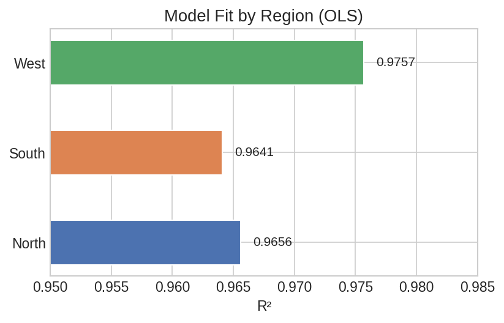
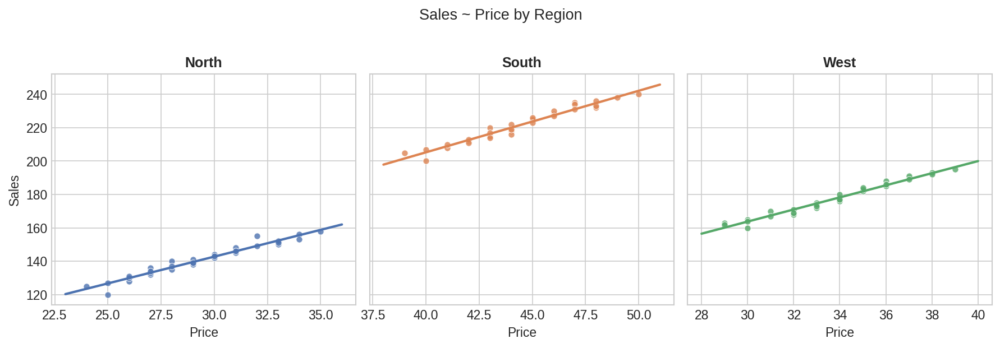

# Group-wise Analysis

The core strength of polars-statistics: run statistical tests and regressions per group using native Polars `group_by` and `over` — no loops, no apply, automatic parallelization.

## Setup

```python
import polars as pl
import polars_statistics as ps

# Sales data across 3 regions
df = pl.DataFrame({
    "region":      (["North"] * 30) + (["South"] * 30) + (["West"] * 30),
    "sales":       [120, 135, 142, 128, 155, 138, 145, 132, 150, 140,
                    125, 148, 133, 156, 141, 130, 152, 137, 144, 127,
                    158, 136, 149, 131, 153, 139, 146, 134, 151, 143,
                    200, 215, 225, 208, 235, 218, 228, 212, 232, 220,
                    205, 230, 213, 238, 222, 210, 234, 217, 226, 207,
                    240, 216, 231, 211, 236, 219, 227, 214, 233, 223,
                    160, 175, 168, 182, 170, 190, 165, 185, 172, 178,
                    163, 188, 171, 193, 176, 167, 191, 174, 183, 162,
                    195, 173, 186, 164, 192, 177, 184, 169, 189, 180],
    "price":       [25, 28, 30, 26, 32, 29, 31, 27, 33, 28,
                    24, 31, 27, 34, 29, 26, 33, 28, 30, 25,
                    35, 27, 32, 26, 34, 29, 31, 27, 33, 30,
                    40, 43, 45, 41, 47, 44, 46, 42, 48, 43,
                    39, 46, 42, 49, 44, 41, 47, 43, 45, 40,
                    50, 44, 47, 42, 48, 44, 46, 43, 48, 45,
                    30, 33, 32, 35, 31, 37, 30, 36, 33, 34,
                    29, 36, 32, 38, 34, 31, 37, 33, 35, 29,
                    39, 33, 36, 30, 38, 34, 35, 32, 37, 34],
    "advertising": [5, 7, 8, 6, 10, 7, 9, 6, 10, 8,
                    5, 9, 7, 11, 8, 6, 10, 7, 9, 5,
                    12, 7, 10, 6, 11, 8, 9, 7, 10, 9,
                    8, 10, 12, 9, 14, 11, 13, 9, 15, 11,
                    7, 13, 10, 15, 12, 9, 14, 10, 12, 8,
                    16, 11, 14, 9, 15, 11, 13, 10, 14, 12,
                    6, 8, 7, 10, 7, 12, 6, 11, 8, 9,
                    5, 11, 7, 13, 9, 6, 12, 8, 10, 5,
                    14, 8, 11, 6, 13, 9, 10, 7, 12, 9],
})
```

## group_by: One Result per Group

### Regression per Group

Fit a separate OLS model for each region:

```python
models = (
    df.group_by("region")
    .agg(
        ps.ols("sales", "price", "advertising").alias("model")
    )
    .sort("region")
)

# Extract model metrics into a flat comparison table
comparison = models.with_columns(
    pl.col("model").struct.field("r_squared").alias("r_squared"),
    pl.col("model").struct.field("adj_r_squared").alias("adj_r_squared"),
    pl.col("model").struct.field("rmse").alias("rmse"),
    pl.col("model").struct.field("intercept").alias("intercept"),
    pl.col("model").struct.field("coefficients").list.get(0).alias("coef_price"),
    pl.col("model").struct.field("coefficients").list.get(1).alias("coef_advertising"),
).drop("model")

print(comparison)
# ┌────────┬───────────┬───────────────┬──────────┬────────────┬────────────┬──────────────────┐
# │ region ┆ r_squared ┆ adj_r_squared ┆ rmse     ┆ intercept  ┆ coef_price ┆ coef_advertising │
# ╞════════╪═══════════╪═══════════════╪══════════╪════════════╪════════════╪══════════════════╡
# │ North  ┆ 0.9656    ┆ 0.9631        ┆ 1.9168   ┆ 78.4254    ┆ 1.2598     ┆ 3.1266           │
# │ South  ┆ 0.9641    ┆ 0.9615        ┆ 2.1180   ┆ 128.2123   ┆ 1.3818     ┆ 2.7610           │
# │ West   ┆ 0.9757    ┆ 0.9739        ┆ 1.6704   ┆ 101.5713   ┆ 1.6651     ┆ 2.1864           │
# └────────┴───────────┴───────────────┴──────────┴────────────┴────────────┴──────────────────┘
```



??? note "Plot code"

    ```python
    import matplotlib.pyplot as plt

    regions = comparison["region"].to_list()
    r2 = comparison["r_squared"].to_list()
    fig, ax = plt.subplots(figsize=(6, 3.5))
    ax.barh(regions, r2, color=["#4C72B0", "#DD8452", "#55A868"], height=0.5)
    ax.set_xlabel("R²")
    ax.set_title("Model Fit by Region")
    plt.tight_layout()
    plt.savefig("grp_r2_bars.png", dpi=150)
    ```

### Tidy Coefficients per Group

Get a full coefficient table with p-values, broken down by region:

```python
coef_by_region = (
    df.group_by("region")
    .agg(
        ps.ols_summary("sales", "price", "advertising").alias("coefficients")
    )
    .explode("coefficients")
    .unnest("coefficients")
    .sort("region", "term")
)

print(coef_by_region)
# ┌────────┬───────────┬────────────┬───────────┬───────────┬───────────┐
# │ region ┆ term      ┆ estimate   ┆ std_error ┆ statistic ┆ p_value   │
# ╞════════╪═══════════╪════════════╪═══════════╪═══════════╪═══════════╡
# │ North  ┆ intercept ┆ 78.4254    ┆ 10.2659   ┆ 7.6394    ┆ 0.000000  │
# │ North  ┆ x1        ┆ 1.2598     ┆ 0.6009    ┆ 2.0966    ┆ 0.045537  │
# │ North  ┆ x2        ┆ 3.1266     ┆ 0.9448    ┆ 3.3094    ┆ 0.002657  │
# │ South  ┆ intercept ┆ 128.2123   ┆ 28.5727   ┆ 4.4872    ┆ 0.000121  │
# │ South  ┆ x1        ┆ 1.3818     ┆ 0.9237    ┆ 1.4960    ┆ 0.146252  │
# │ South  ┆ x2        ┆ 2.7610     ┆ 1.0931    ┆ 2.5259    ┆ 0.017714  │
# │ West   ┆ intercept ┆ 101.5713   ┆ 23.4301   ┆ 4.3351    ┆ 0.000181  │
# │ West   ┆ x1        ┆ 1.6651     ┆ 0.9793    ┆ 1.7004    ┆ 0.100557  │
# │ West   ┆ x2        ┆ 2.1864     ┆ 1.0846    ┆ 2.0158    ┆ 0.053870  │
# └────────┴───────────┴────────────┴───────────┴───────────┴───────────┘
```

### Statistical Tests per Group

Run hypothesis tests within each group:

```python
df_paired = pl.DataFrame({
    "group":  (["A"] * 20) + (["B"] * 20),
    "before": [85, 90, 78, 92, 88, 76, 95, 83, 89, 91,
               80, 87, 93, 84, 86, 79, 94, 82, 88, 90,
               70, 75, 68, 77, 73, 66, 80, 72, 74, 76,
               65, 72, 78, 69, 71, 64, 79, 67, 73, 75],
    "after":  [89, 94, 83, 96, 92, 81, 99, 88, 93, 95,
               85, 91, 97, 89, 90, 84, 98, 87, 92, 94,
               72, 78, 70, 80, 76, 69, 83, 75, 77, 79,
               68, 75, 81, 72, 74, 67, 82, 70, 76, 78],
})

test_results = (
    df_paired.group_by("group")
    .agg(
        ps.ttest_paired("before", "after").alias("paired_t"),
        ps.wilcoxon_signed_rank("before", "after").alias("wilcoxon"),
        ps.shapiro_wilk("before").alias("normality"),
    )
    .sort("group")
)

# Flatten into a readable table
for row in test_results.iter_rows(named=True):
    group = row["group"]
    t = row["paired_t"]
    w = row["wilcoxon"]
    n = row["normality"]
    print(f"Group {group}:")
    print(f"  Paired t-test: t={t['statistic']:.3f}, p={t['p_value']:.6f}")
    print(f"  Wilcoxon:      W={w['statistic']:.3f}, p={w['p_value']:.6f}")
    print(f"  Normality:     W={n['statistic']:.4f}, p={n['p_value']:.4f}")
```

Expected output:

```
Group A:
  Paired t-test: t=-39.753, p=0.000000
  Wilcoxon:      W=-0.000, p=0.000051
  Normality:     W=0.9677, p=0.7065
Group B:
  Paired t-test: t=-42.136, p=0.000000
  Wilcoxon:      W=-0.000, p=0.000019
  Normality:     W=0.9743, p=0.8423
```

### Correlation per Group

```python
corr_by_region = (
    df.group_by("region")
    .agg(
        ps.pearson("sales", "price").alias("sales_price"),
        ps.pearson("sales", "advertising").alias("sales_ad"),
    )
    .sort("region")
    .with_columns(
        pl.col("sales_price").struct.field("estimate").alias("r_sales_price"),
        pl.col("sales_ad").struct.field("estimate").alias("r_sales_ad"),
    )
    .select("region", "r_sales_price", "r_sales_ad")
)

print(corr_by_region)
```

## over: Per-Row Results

### Predictions per Group

Use `.over()` to get per-row predictions from group-specific models:

```python
predictions = (
    df.with_columns(
        ps.ols_predict("sales", "price", "advertising",
                       interval="prediction", level=0.95)
        .over("region")
        .alias("pred")
    )
    .unnest("pred")
)

print(predictions.select("region", "sales", "ols_prediction", "ols_lower", "ols_upper").head(5))
# Each row has a prediction from its region-specific model
```



??? note "Plot code"

    ```python
    import matplotlib.pyplot as plt
    import numpy as np

    fig, axes = plt.subplots(1, 3, figsize=(12, 4), sharey=True)
    for ax, region in zip(axes, ["North", "South", "West"]):
        subset = predictions.filter(pl.col("region") == region)
        ax.scatter(subset["price"], subset["sales"], s=30, alpha=0.8)
        m, b = np.polyfit(subset["price"].to_numpy(), subset["sales"].to_numpy(), 1)
        x = np.linspace(subset["price"].min(), subset["price"].max(), 50)
        ax.plot(x, m * x + b, lw=2)
        ax.set_title(region)
        ax.set_xlabel("Price")
    axes[0].set_ylabel("Sales")
    fig.suptitle("Sales ~ Price by Region")
    plt.tight_layout()
    plt.savefig("grp_regression_lines.png", dpi=150)
    ```

### Residuals

Calculate residuals from group-specific fits:

```python
with_residuals = (
    df.with_columns(
        ps.ols_predict("sales", "price", "advertising")
        .over("region")
        .alias("pred")
    )
    .unnest("pred")
    .with_columns(
        (pl.col("sales") - pl.col("ols_prediction")).alias("residual")
    )
)

# Residual summary by region
residual_stats = (
    with_residuals.group_by("region")
    .agg(
        pl.col("residual").mean().alias("mean_residual"),
        pl.col("residual").std().alias("std_residual"),
        pl.col("residual").abs().max().alias("max_abs_residual"),
    )
    .sort("region")
)
print(residual_stats)
```

Expected output:

```
┌────────┬───────────────┬──────────────┬──────────────────┐
│ region ┆ mean_residual ┆ std_residual ┆ max_abs_residual │
╞════════╪═══════════════╪══════════════╪══════════════════╡
│ North  ┆ ≈0.0          ┆ 1.8495       ┆ 5.5527           │
│ South  ┆ ≈0.0          ┆ 2.0436       ┆ 5.5724           │
│ West   ┆ ≈0.0          ┆ 1.6117       ┆ 4.6419           │
└────────┴───────────────┴──────────────┴──────────────────┘
```

### Broadcast Test Results to Rows

Use `.over()` to attach group-level test results to every row:

```python
annotated = (
    df.with_columns(
        ps.shapiro_wilk("sales").over("region").alias("normality_test")
    )
    .with_columns(
        pl.col("normality_test").struct.field("p_value").alias("normality_p"),
    )
    .with_columns(
        pl.when(pl.col("normality_p") > 0.05)
        .then(pl.lit("normal"))
        .otherwise(pl.lit("non-normal"))
        .alias("distribution")
    )
)

print(annotated.select("region", "sales", "normality_p", "distribution").head(5))
```

## Combining group_by and over

A common pattern: fit models with `group_by`, then use `.over()` for predictions:

```python
# Step 1: Compare model quality across groups
model_quality = (
    df.group_by("region")
    .agg(
        ps.ols("sales", "price", "advertising").alias("ols"),
        ps.ridge("sales", "price", "advertising", lambda_=1.0).alias("ridge"),
    )
    .with_columns(
        pl.col("ols").struct.field("r_squared").alias("ols_r2"),
        pl.col("ridge").struct.field("r_squared").alias("ridge_r2"),
    )
    .select("region", "ols_r2", "ridge_r2")
    .sort("region")
)
print(model_quality)

# Step 2: Generate per-row predictions from the better model
final = (
    df.with_columns(
        ps.ols_predict("sales", "price", "advertising", interval="prediction")
        .over("region")
        .alias("pred")
    )
    .unnest("pred")
)
```

## Multiple Formulas per Group

Compare model specifications using formula syntax:

```python
specs = (
    df.group_by("region")
    .agg(
        ps.ols_formula("sales ~ price + advertising").alias("additive"),
        ps.ols_formula("sales ~ price * advertising").alias("interaction"),
    )
    .with_columns(
        pl.col("additive").struct.field("r_squared").alias("r2_additive"),
        pl.col("additive").struct.field("aic").alias("aic_additive"),
        pl.col("interaction").struct.field("r_squared").alias("r2_interaction"),
        pl.col("interaction").struct.field("aic").alias("aic_interaction"),
    )
    .select("region", "r2_additive", "aic_additive", "r2_interaction", "aic_interaction")
    .sort("region")
)
print(specs)
# Lower AIC = better fit. Compare additive vs interaction model per region.
```
