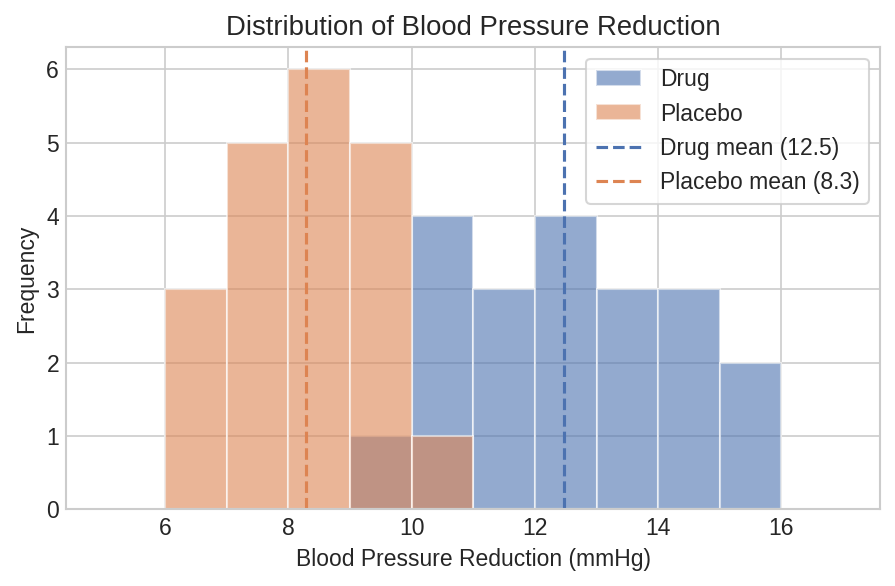
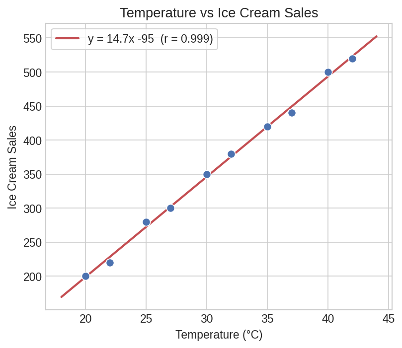
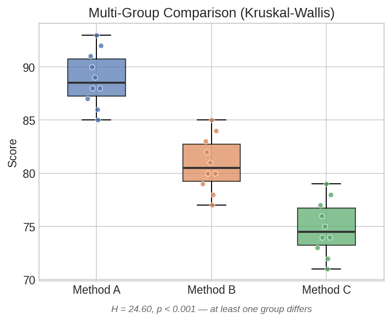

# Hypothesis Testing Workflow

A complete workflow for comparing two groups: check assumptions, choose the right test, extract and interpret results — all using Polars expressions.

## Setup

```python
import polars as pl
import polars_statistics as ps

# Clinical trial data: blood pressure reduction (mmHg) in two groups
df = pl.DataFrame({
    "drug": [12.3, 10.1, 14.5, 11.8, 13.2, 9.7, 15.1, 12.8, 10.5, 14.0,
             11.2, 13.9, 10.8, 12.6, 14.3, 11.5, 13.7, 10.2, 12.1, 15.0],
    "placebo": [8.1, 7.5, 9.2, 6.8, 10.1, 7.9, 8.5, 9.8, 7.2, 8.7,
                9.5, 6.5, 8.3, 7.1, 9.9, 8.0, 7.6, 9.3, 6.9, 8.8],
})
```

## Step 1: Check Normality

Before choosing a parametric test, check whether each group is approximately normal:

```python
normality = df.select(
    ps.shapiro_wilk("drug").alias("drug_normality"),
    ps.shapiro_wilk("placebo").alias("placebo_normality"),
)

drug_sw = normality["drug_normality"][0]
placebo_sw = normality["placebo_normality"][0]

print(f"Drug:    W={drug_sw['statistic']:.4f}, p={drug_sw['p_value']:.4f}")
print(f"Placebo: W={placebo_sw['statistic']:.4f}, p={placebo_sw['p_value']:.4f}")
# p > 0.05 → no evidence against normality → parametric test is appropriate
```

Expected output:

```
Drug:    W=0.9536, p=0.4243
Placebo: W=0.9609, p=0.5619
```



??? note "Plot code"

    ```python
    import matplotlib.pyplot as plt
    import numpy as np

    fig, ax = plt.subplots(figsize=(7, 4))
    bins = np.linspace(5, 17, 13)
    ax.hist(df["drug"].to_list(), bins=bins, alpha=0.6, label="Drug", color="#4C72B0")
    ax.hist(df["placebo"].to_list(), bins=bins, alpha=0.6, label="Placebo", color="#DD8452")
    ax.axvline(df["drug"].mean(), color="#4C72B0", ls="--", lw=1.5)
    ax.axvline(df["placebo"].mean(), color="#DD8452", ls="--", lw=1.5)
    ax.set_xlabel("Blood Pressure Reduction (mmHg)")
    ax.set_ylabel("Frequency")
    ax.legend()
    plt.tight_layout()
    plt.savefig("hyp_distributions.png", dpi=150)
    ```

## Step 2: Check Variance Equality

The Brown-Forsythe test checks whether the two groups have equal variances:

```python
var_test = df.select(
    ps.brown_forsythe("drug", "placebo").alias("bf")
)

bf = var_test["bf"][0]
print(f"Brown-Forsythe: F={bf['statistic']:.4f}, p={bf['p_value']:.4f}")
# p > 0.05 → variances are roughly equal
```

Expected output:

```
Brown-Forsythe: F=5.0951, p=0.0298
```

## Step 3: Run the Right Test

Based on the assumption checks, pick the appropriate test:

```python
result = df.select(
    # Parametric (if both groups are normal)
    ps.ttest_ind("drug", "placebo").alias("ttest"),

    # Non-parametric alternative (if normality fails)
    ps.mann_whitney_u("drug", "placebo").alias("mann_whitney"),

    # Robust alternative (handles outliers via trimmed means)
    ps.yuen_test("drug", "placebo", trim=0.2).alias("yuen"),
)

ttest = result["ttest"][0]
mwu = result["mann_whitney"][0]
yuen = result["yuen"][0]

print(f"t-test:       t={ttest['statistic']:.4f}, p={ttest['p_value']:.6f}")
print(f"Mann-Whitney: U={mwu['statistic']:.4f}, p={mwu['p_value']:.6f}")
print(f"Yuen:         t={yuen['statistic']:.4f}, p={yuen['p_value']:.6f}")
```

Expected output:

```
t-test:       t=9.1739, p=0.000000
Mann-Whitney: U=396.5000, p=0.000000
Yuen:         t=7.1158, p=0.000001
```

## Step 4: One-Sided Tests

If you have a directional hypothesis (e.g., "drug is better than placebo"):

```python
one_sided = df.select(
    ps.ttest_ind("drug", "placebo", alternative="greater").alias("ttest"),
)

t = one_sided["ttest"][0]
print(f"One-sided t-test: t={t['statistic']:.4f}, p={t['p_value']:.6f}")
```

Expected output:

```
One-sided t-test: t=9.1739, p=0.000000
```

## Step 5: Collect Everything into a Summary Table

Run all tests at once and build a comparison DataFrame:

```python
tests = df.select(
    ps.ttest_ind("drug", "placebo").alias("ttest"),
    ps.mann_whitney_u("drug", "placebo").alias("mwu"),
    ps.yuen_test("drug", "placebo", trim=0.2).alias("yuen"),
    ps.brunner_munzel("drug", "placebo").alias("bm"),
)

summary = pl.DataFrame({
    "test": ["t-test (Welch)", "Mann-Whitney U", "Yuen (trim=0.2)", "Brunner-Munzel"],
    "statistic": [
        tests["ttest"][0]["statistic"],
        tests["mwu"][0]["statistic"],
        tests["yuen"][0]["statistic"],
        tests["bm"][0]["statistic"],
    ],
    "p_value": [
        tests["ttest"][0]["p_value"],
        tests["mwu"][0]["p_value"],
        tests["yuen"][0]["p_value"],
        tests["bm"][0]["p_value"],
    ],
})

print(summary)
# ┌─────────────────┬───────────┬──────────┐
# │ test            ┆ statistic ┆ p_value  │
# ╞═════════════════╪═══════════╪══════════╡
# │ t-test (Welch)  ┆ 9.1739    ┆ 0.000000 │
# │ Mann-Whitney U  ┆ 396.5     ┆ 0.000000 │
# │ Yuen (trim=0.2) ┆ 7.1158    ┆ 0.000001 │
# │ Brunner-Munzel  ┆ -54.6655  ┆ 0.000000 │
# └─────────────────┴───────────┴──────────┘
```

## Correlation Analysis

Measure the strength and significance of associations:

```python
df_cor = pl.DataFrame({
    "temperature": [20, 22, 25, 27, 30, 32, 35, 37, 40, 42],
    "ice_cream_sales": [200, 220, 280, 300, 350, 380, 420, 440, 500, 520],
    "sunscreen_sales": [150, 160, 210, 230, 270, 290, 340, 360, 400, 420],
})

correlations = df_cor.select(
    ps.pearson("temperature", "ice_cream_sales").alias("pearson"),
    ps.spearman("temperature", "ice_cream_sales").alias("spearman"),
    ps.kendall("temperature", "ice_cream_sales", variant="b").alias("kendall"),
)

p = correlations["pearson"][0]
print(f"Pearson:  r={p['estimate']:.4f}, p={p['p_value']:.6f}, "
      f"95% CI=[{p['ci_lower']:.4f}, {p['ci_upper']:.4f}]")

s = correlations["spearman"][0]
print(f"Spearman: ρ={s['estimate']:.4f}, p={s['p_value']:.6f}")
```

Expected output:

```
Pearson:  r=0.9986, p=0.000000, 95% CI=[0.9940, 0.9997]
Spearman: ρ=1.0000, p=0.000000
```



??? note "Plot code"

    ```python
    import matplotlib.pyplot as plt
    import numpy as np

    temp = df_cor["temperature"].to_numpy()
    sales = df_cor["ice_cream_sales"].to_numpy()
    m, b = np.polyfit(temp, sales, 1)

    fig, ax = plt.subplots(figsize=(6, 5))
    ax.scatter(temp, sales, s=60, color="#4C72B0", edgecolor="white")
    x = np.linspace(18, 44, 100)
    ax.plot(x, m * x + b, color="#C44E52", lw=2, label=f"y = {m:.1f}x {b:+.0f}")
    ax.set_xlabel("Temperature (°C)")
    ax.set_ylabel("Ice Cream Sales")
    ax.legend()
    plt.tight_layout()
    plt.savefig("hyp_correlation.png", dpi=150)
    ```

### Partial Correlation

Control for confounding variables:

```python
# Is temperature → ice cream sales still significant after controlling for sunscreen?
partial = df_cor.select(
    ps.partial_cor("temperature", "ice_cream_sales", ["sunscreen_sales"]).alias("partial"),
)

pc = partial["partial"][0]
print(f"Partial correlation: r={pc['estimate']:.4f}, p={pc['p_value']:.6f}")
```

Expected output:

```
Partial correlation: r=0.5453, p=0.128937
```

## Multi-Group Comparison

Compare three or more groups with a single test:

```python
df_multi = pl.DataFrame({
    "method_a": [85, 90, 88, 92, 87, 91, 86, 89, 93, 88],
    "method_b": [78, 82, 80, 84, 79, 83, 77, 81, 85, 80],
    "method_c": [72, 76, 74, 78, 73, 77, 71, 75, 79, 74],
})

kw = df_multi.select(
    ps.kruskal_wallis("method_a", "method_b", "method_c").alias("kw")
)

result = kw["kw"][0]
print(f"Kruskal-Wallis: H={result['statistic']:.4f}, p={result['p_value']:.6f}")
# Significant → at least one group differs. Follow up with pairwise tests.

# Pairwise follow-up
pairs = df_multi.select(
    ps.mann_whitney_u("method_a", "method_b").alias("a_vs_b"),
    ps.mann_whitney_u("method_a", "method_c").alias("a_vs_c"),
    ps.mann_whitney_u("method_b", "method_c").alias("b_vs_c"),
)

for name in ["a_vs_b", "a_vs_c", "b_vs_c"]:
    r = pairs[name][0]
    print(f"  {name}: U={r['statistic']:.1f}, p={r['p_value']:.6f}")
```

Expected output:

```
Kruskal-Wallis: H=24.6015, p=0.000005

  a_vs_b: U=99.5, p=0.000209
  a_vs_c: U=100.0, p=0.000181
  b_vs_c: U=95.5, p=0.000654
```



??? note "Plot code"

    ```python
    import matplotlib.pyplot as plt
    import numpy as np

    fig, ax = plt.subplots(figsize=(6, 4.5))
    bp = ax.boxplot(
        [df_multi["method_a"].to_list(), df_multi["method_b"].to_list(),
         df_multi["method_c"].to_list()],
        tick_labels=["Method A", "Method B", "Method C"],
        patch_artist=True, widths=0.5,
    )
    for patch, color in zip(bp["boxes"], ["#4C72B0", "#DD8452", "#55A868"]):
        patch.set_facecolor(color)
        patch.set_alpha(0.7)
    ax.set_ylabel("Score")
    ax.set_title("Multi-Group Comparison")
    plt.tight_layout()
    plt.savefig("hyp_boxplot_multigroup.png", dpi=150)
    ```
