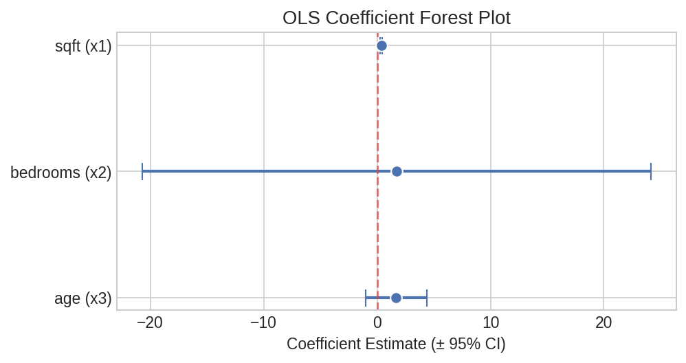
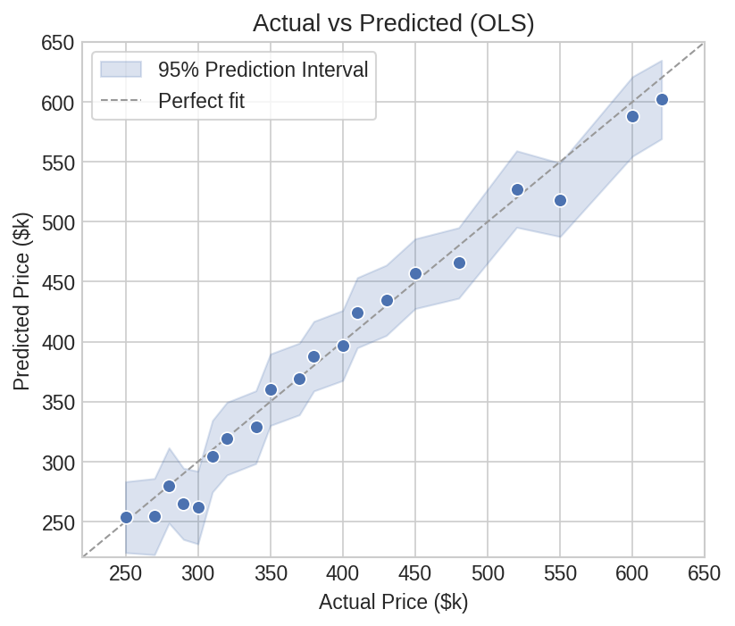
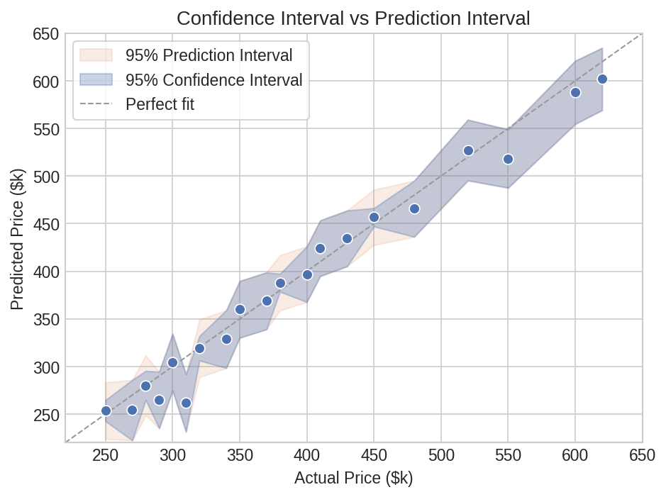
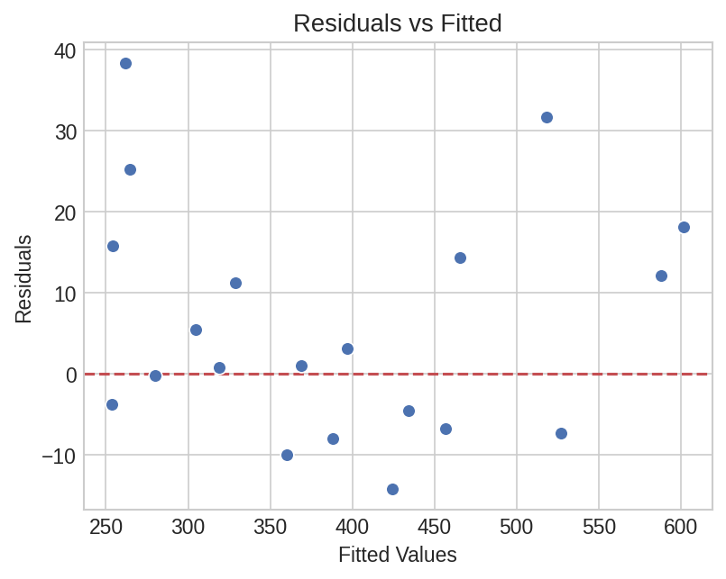
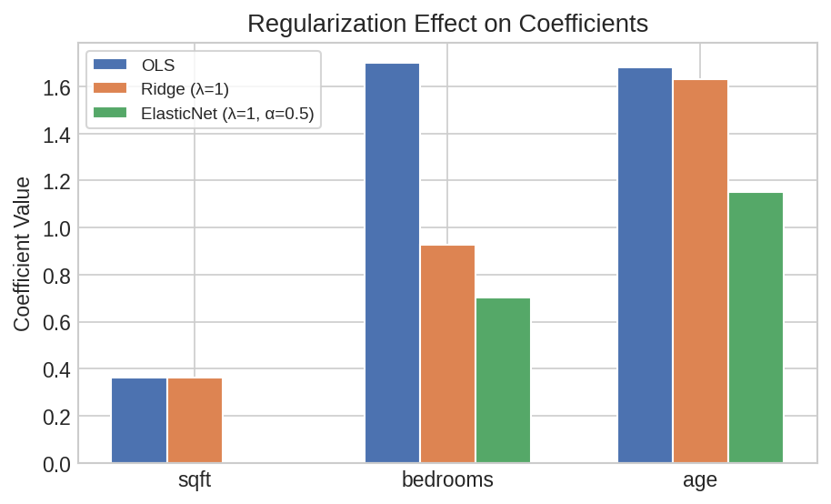
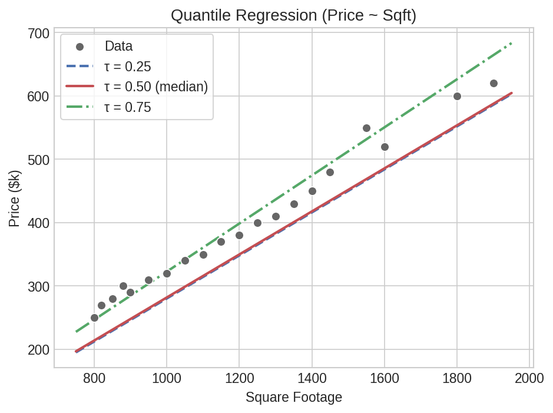

# Regression Workflow

A complete regression analysis: fit a model, inspect coefficients, generate predictions with intervals, and run diagnostics — all in Polars.

## Setup

```python
import polars as pl
import polars_statistics as ps

# Apartment pricing data
df = pl.DataFrame({
    "price":    [250, 320, 280, 450, 380, 520, 290, 410, 350, 600,
                 270, 340, 310, 480, 400, 550, 300, 430, 370, 620],
    "sqft":     [800, 1000, 850, 1400, 1200, 1600, 900, 1300, 1100, 1800,
                 820, 1050, 950, 1450, 1250, 1550, 880, 1350, 1150, 1900],
    "bedrooms": [1, 2, 1, 3, 2, 3, 1, 2, 2, 4,
                 1, 2, 2, 3, 2, 3, 1, 3, 2, 4],
    "age":      [15, 10, 20, 5, 8, 3, 18, 6, 12, 2,
                 16, 9, 14, 4, 7, 3, 19, 5, 11, 1],
})
```

## Step 1: Fit a Model

```python
result = df.select(
    ps.ols("price", "sqft", "bedrooms", "age").alias("model")
)

model = result["model"][0]
print(f"R²:     {model['r_squared']:.4f}")
print(f"Adj R²: {model['adj_r_squared']:.4f}")
print(f"RMSE:   {model['rmse']:.2f}")
print(f"AIC:    {model['aic']:.2f}")
print(f"F-stat: {model['f_statistic']:.2f} (p={model['f_pvalue']:.6f})")
print(f"Intercept:    {model['intercept']:.4f}")
print(f"Coefficients: {model['coefficients']}")
```

Expected output:

```
R²:     0.9885
Adj R²: 0.9863
RMSE:   12.95
AIC:    167.20
F-stat: 457.22 (p=0.000000)
Intercept:    -61.7424
Coefficients: [0.3607, 1.7018, 1.6806]
```

## Step 2: Tidy Coefficient Table

Get a publication-ready coefficient summary with standard errors and p-values:

```python
coef_table = (
    df.select(
        ps.ols_summary("price", "sqft", "bedrooms", "age").alias("coef")
    )
    .explode("coef")
    .unnest("coef")
)

print(coef_table)
# ┌───────────┬───────────┬───────────┬───────────┬───────────┐
# │ term      ┆ estimate  ┆ std_error ┆ statistic ┆ p_value   │
# ╞═══════════╪═══════════╪═══════════╪═══════════╪═══════════╡
# │ intercept ┆ -61.7424  ┆ 39.8851   ┆ -1.5480   ┆ 0.141171  │
# │ x1        ┆ 0.3607    ┆ 0.0332    ┆ 10.8486   ┆ 0.000000  │
# │ x2        ┆ 1.7018    ┆ 11.4411   ┆ 0.1487    ┆ 0.883615  │
# │ x3        ┆ 1.6806    ┆ 1.3684    ┆ 1.2281    ┆ 0.237166  │
# └───────────┴───────────┴───────────┴───────────┴───────────┘
```



??? note "Plot code"

    ```python
    import matplotlib.pyplot as plt
    import numpy as np

    terms = coef_table["term"].to_list()[1:]  # skip intercept
    est = coef_table["estimate"].to_list()[1:]
    se = coef_table["std_error"].to_list()[1:]
    ci_lo = [e - 1.96 * s for e, s in zip(est, se)]
    ci_hi = [e + 1.96 * s for e, s in zip(est, se)]

    fig, ax = plt.subplots(figsize=(7, 3.5))
    y = np.arange(len(terms))
    ax.errorbar(est, y, xerr=[[e - lo for e, lo in zip(est, ci_lo)],
                                [hi - e for e, hi in zip(est, ci_hi)]],
                fmt="o", color="#4C72B0", ms=8, capsize=6, lw=2)
    ax.axvline(0, color="#C44E52", ls="--", lw=1.5, alpha=0.7)
    ax.set_yticks(y)
    ax.set_yticklabels(terms)
    ax.set_xlabel("Coefficient Estimate (± 95% CI)")
    ax.invert_yaxis()
    plt.tight_layout()
    plt.savefig("reg_coef_forest.png", dpi=150)
    ```

### Robust Standard Errors

Use heteroskedasticity-consistent (HC) standard errors when variance isn't constant:

```python
robust_coefs = (
    df.select(
        ps.ols_summary("price", "sqft", "bedrooms", "age", hc_type="hc3").alias("coef")
    )
    .explode("coef")
    .unnest("coef")
)
# hc_type options: "hc0", "hc1", "hc2", "hc3"
```

## Step 3: Predictions with Intervals

Generate predictions for every row, with 95% prediction intervals:

```python
predictions = (
    df.with_columns(
        ps.ols_predict("price", "sqft", "bedrooms", "age",
                       interval="prediction", level=0.95).alias("pred")
    )
    .unnest("pred")
)

print(predictions.select("price", "ols_prediction", "ols_lower", "ols_upper").head(5))
# ┌───────┬────────────────┬───────────┬───────────┐
# │ price ┆ ols_prediction ┆ ols_lower ┆ ols_upper │
# ╞═══════╪════════════════╪═══════════╪═══════════╡
# │ 250.0 ┆ 253.70         ┆ 224.10    ┆ 283.29    │
# │ 320.0 ┆ 319.13         ┆ 288.82    ┆ 349.43    │
# │ 280.0 ┆ 280.13         ┆ 248.74    ┆ 311.52    │
# │ 450.0 ┆ 456.69         ┆ 427.59    ┆ 485.79    │
# │ 380.0 ┆ 387.90         ┆ 358.88    ┆ 416.92    │
# └───────┴────────────────┴───────────┴───────────┘
```



??? note "Plot code"

    ```python
    import matplotlib.pyplot as plt

    fig, ax = plt.subplots(figsize=(6, 5))
    ax.scatter(predictions["price"], predictions["ols_prediction"],
               s=50, color="#4C72B0", edgecolor="white")
    lim = [220, 650]
    ax.plot(lim, lim, ls="--", color="#999", lw=1, label="Perfect fit")
    ax.fill_between(
        predictions.sort("price")["price"],
        predictions.sort("price")["ols_lower"],
        predictions.sort("price")["ols_upper"],
        alpha=0.2, color="#4C72B0", label="95% PI")
    ax.set_xlabel("Actual Price ($k)")
    ax.set_ylabel("Predicted Price ($k)")
    ax.legend()
    plt.tight_layout()
    plt.savefig("reg_actual_vs_pred.png", dpi=150)
    ```

Confidence intervals (for the mean response) are narrower than prediction intervals:

```python
ci = (
    df.with_columns(
        ps.ols_predict("price", "sqft", "bedrooms", "age",
                       interval="confidence", level=0.95).alias("pred")
    )
    .unnest("pred")
)
```



??? note "Plot code"

    ```python
    import matplotlib.pyplot as plt

    fig, ax = plt.subplots(figsize=(7, 5))
    sorted_df = predictions.sort("price")
    ci_sorted = ci.sort("price")

    ax.fill_between(sorted_df["price"], sorted_df["ols_lower"], sorted_df["ols_upper"],
                    alpha=0.15, color="#DD8452", label="95% Prediction Interval")
    ax.fill_between(ci_sorted["price"], ci_sorted["ols_lower"], ci_sorted["ols_upper"],
                    alpha=0.3, color="#4C72B0", label="95% Confidence Interval")
    ax.scatter(predictions["price"], predictions["ols_prediction"],
               s=50, color="#4C72B0", edgecolor="white")
    lim = [220, 650]
    ax.plot(lim, lim, ls="--", color="#999", lw=1, label="Perfect fit")
    ax.set_xlabel("Actual Price ($k)")
    ax.set_ylabel("Predicted Price ($k)")
    ax.set_title("CI (narrow) vs PI (wide)")
    ax.legend()
    plt.tight_layout()
    plt.savefig("reg_ci_vs_pi.png", dpi=150)
    ```

## Step 4: Diagnostics

### Multicollinearity Check

```python
cond = df.select(
    ps.condition_number("sqft", "bedrooms", "age").alias("cond")
)

c = cond["cond"][0]
print(f"Condition number: {c['condition_number']:.1f}")
print(f"Severity: {c['severity']}")
# "WellConditioned" (< 30), "Moderate" (30-100),
# "Serious" (100-1000), "Severe" (> 1000)
```

Expected output:

```
Condition number: 17309.4
Severity: Severe
```



??? note "Plot code"

    ```python
    import matplotlib.pyplot as plt

    residuals = predictions["price"] - predictions["ols_prediction"]
    fig, ax = plt.subplots(figsize=(6, 4.5))
    ax.scatter(predictions["ols_prediction"], residuals,
               s=50, color="#4C72B0", edgecolor="white")
    ax.axhline(0, color="#C44E52", ls="--", lw=1.5)
    ax.set_xlabel("Fitted Values")
    ax.set_ylabel("Residuals")
    plt.tight_layout()
    plt.savefig("reg_residuals.png", dpi=150)
    ```

### Regularization When Needed

If multicollinearity is a concern, compare OLS with regularized models:

```python
comparison = df.select(
    ps.ols("price", "sqft", "bedrooms", "age").alias("ols"),
    ps.ridge("price", "sqft", "bedrooms", "age", lambda_=1.0).alias("ridge"),
    ps.elastic_net("price", "sqft", "bedrooms", "age",
                   lambda_=1.0, alpha=0.5).alias("enet"),
)

for name in ["ols", "ridge", "enet"]:
    m = comparison[name][0]
    print(f"{name:12s} R²={m['r_squared']:.4f}  RMSE={m['rmse']:.2f}  "
          f"coefficients={m['coefficients']}")
```

Expected output:

```
ols          R²=0.9885  RMSE=12.95   coefficients=[0.3607, 1.7018, 1.6806]
ridge        R²=0.9885  RMSE=12.95   coefficients=[0.3620, 0.9253, 1.6313]
enet         R²=0.0000  RMSE=122.92  coefficients=[0.0, 0.7043, 1.1512]
```



??? note "Plot code"

    ```python
    import matplotlib.pyplot as plt
    import numpy as np

    terms = ["sqft", "bedrooms", "age"]
    ols_c = [comparison["ols"][0]["coefficients"][i] for i in range(3)]
    ridge_c = [comparison["ridge"][0]["coefficients"][i] for i in range(3)]
    enet_c = [comparison["enet"][0]["coefficients"][i] for i in range(3)]

    x = np.arange(len(terms))
    w = 0.22
    fig, ax = plt.subplots(figsize=(7, 4))
    ax.bar(x - w, ols_c, w, label="OLS", color="#4C72B0")
    ax.bar(x, ridge_c, w, label="Ridge", color="#DD8452")
    ax.bar(x + w, enet_c, w, label="ElasticNet", color="#55A868")
    ax.set_xticks(x)
    ax.set_xticklabels(terms)
    ax.set_ylabel("Coefficient Value")
    ax.legend()
    plt.tight_layout()
    plt.savefig("reg_regularization_coefs.png", dpi=150)
    ```

## Formula Syntax

Use R-style formulas for interactions and polynomials:

```python
# Main effects only
result = df.select(ps.ols_formula("price ~ sqft + bedrooms + age").alias("model"))

# Interaction: sqft effect may depend on number of bedrooms
result = df.select(ps.ols_formula("price ~ sqft * bedrooms + age").alias("model"))
# Expands to: sqft + bedrooms + sqft:bedrooms + age

# Polynomial: non-linear relationship with age
result = df.select(ps.ols_formula("price ~ sqft + bedrooms + poly(age, 2)").alias("model"))
model = result["model"][0]
print(f"R² with quadratic age: {model['r_squared']:.4f}")
```

Expected output:

```
R² with quadratic age: 0.9902
```

## Quantile Regression

When you care about the median (or other quantiles) rather than the mean:

```python
quantiles = df.select(
    ps.quantile("price", "sqft", "bedrooms", "age", tau=0.25).alias("q25"),
    ps.quantile("price", "sqft", "bedrooms", "age", tau=0.50).alias("q50"),
    ps.quantile("price", "sqft", "bedrooms", "age", tau=0.75).alias("q75"),
)

for name, tau in [("q25", 0.25), ("q50", 0.50), ("q75", 0.75)]:
    m = quantiles[name][0]
    print(f"τ={tau}: intercept={m['intercept']:.2f}, coefficients={m['coefficients']}")
```

Expected output:

```
τ=0.25: intercept=-60.00, coefficients=[0.34, 8.00, 2.00]
τ=0.50: intercept=-58.38, coefficients=[0.34, 7.03, 1.92]
τ=0.75: intercept=-57.58, coefficients=[0.38, -5.91, 1.53]
```



??? note "Plot code"

    ```python
    import matplotlib.pyplot as plt
    import numpy as np

    fig, ax = plt.subplots(figsize=(7, 5))
    ax.scatter(df["sqft"], df["price"], s=50, color="#666", edgecolor="white")
    x = np.linspace(750, 1950, 100)
    for name, tau, c, ls in [("q25", 0.25, "#4C72B0", "--"),
                              ("q50", 0.50, "#C44E52", "-"),
                              ("q75", 0.75, "#55A868", "-.")]:
        m = quantiles[name][0]
        ax.plot(x, m["intercept"] + m["coefficients"][0] * x,
                color=c, lw=2, ls=ls, label=f"τ = {tau}")
    ax.set_xlabel("Square Footage")
    ax.set_ylabel("Price ($k)")
    ax.legend()
    plt.tight_layout()
    plt.savefig("reg_quantile_lines.png", dpi=150)
    ```

## GLM: Logistic Regression

Binary outcome — predict whether a unit sells above median price:

```python
median_price = df["price"].median()
df_binary = df.with_columns(
    (pl.col("price") > median_price).cast(pl.Float64).alias("above_median")
)

# Check for separation issues first
sep = df_binary.select(
    ps.check_binary_separation("above_median", "sqft", "bedrooms", "age").alias("sep")
)
print(f"Has separation: {sep['sep'][0]['has_separation']}")

# Fit logistic regression
logit = df_binary.select(
    ps.logistic("above_median", "sqft", "bedrooms", "age").alias("model")
)

model = logit["model"][0]
print(f"Intercept:    {model['intercept']:.4f}")
print(f"Coefficients: {model['coefficients']}")

# Coefficient summary
logit_coefs = (
    df_binary.select(
        ps.logistic_summary("above_median", "sqft", "bedrooms", "age").alias("coef")
    )
    .explode("coef")
    .unnest("coef")
)
print(logit_coefs)
```

Expected output:

```
Has separation: True
Intercept:    -720227972.3328
Coefficients: [4890926935.688748, -4818191647.238056, 14385833.81900725]
```

!!! warning "Separation detected"

    `has_separation = True` means the predictors perfectly separate the outcome.
    The huge coefficients are a sign of quasi-complete separation — logistic
    regression cannot converge to finite estimates. Consider regularization or
    Firth's penalized likelihood.

```
┌───────────┬───────────┬───────────────┬───────────────┬─────────┐
│ term      ┆ estimate  ┆ std_error     ┆ statistic     ┆ p_value │
╞═══════════╪═══════════╪═══════════════╪═══════════════╪═════════╡
│ intercept ┆ -7.2023e8 ┆ 308015.430546 ┆ -2338.285361  ┆ 0.0     │
│ x1        ┆ 4.8909e9  ┆ 256.734863    ┆ 1.9050e7      ┆ 0.0     │
│ x2        ┆ -4.8182e9 ┆ 88354.414096  ┆ -54532.551616 ┆ 0.0     │
│ x3        ┆ 1.4386e7  ┆ 10567.909939  ┆ 1361.27521    ┆ 0.0     │
└───────────┴───────────┴───────────────┴───────────────┴─────────┘
```
