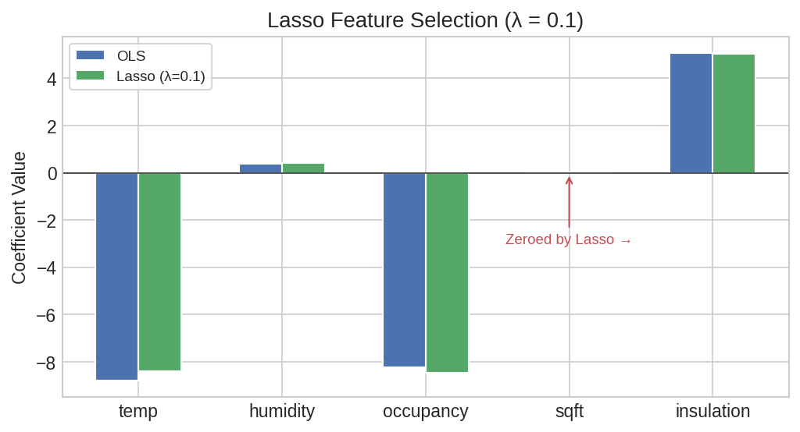
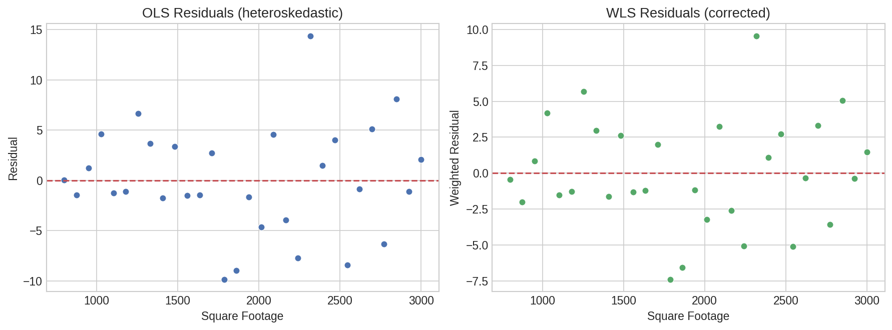
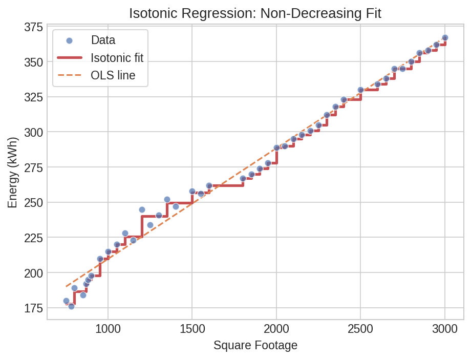

# Regularized & Specialized Linear Models

Beyond ordinary least squares, real-world data often calls for regularized or constrained estimators. Correlated predictors inflate OLS coefficient variance, heteroskedastic errors violate constant-variance assumptions, and streaming data demands online updates. This page walks through Lasso, Ridge, Elastic Net, Weighted Least Squares, Recursive Least Squares, Bounded/Non-Negative regression, and Isotonic regression — all as native Polars expressions.

## Setup

Energy consumption prediction for commercial buildings with correlated features (square footage, insulation rating, and temperature are all interrelated):

```python
import polars as pl
import polars_statistics as ps

df = pl.DataFrame({
    "kwh": [245, 312, 198, 367, 289, 401, 176, 334, 256, 423,
            210, 345, 278, 389, 301, 412, 189, 356, 267, 434,
            223, 323, 234, 378, 295, 398, 184, 345, 262, 445,
            215, 330, 247, 385, 305, 420, 192, 362, 274, 440,
            228, 318, 241, 372, 290, 405, 180, 350, 258, 430,
            220, 338, 252, 392, 298, 415, 195, 358, 270, 442],
    "temp": [32, 28, 35, 25, 30, 22, 38, 26, 33, 20,
             36, 27, 31, 24, 29, 21, 37, 25, 32, 19,
             34, 28, 35, 24, 30, 23, 38, 26, 33, 18,
             36, 27, 34, 23, 29, 21, 37, 25, 31, 19,
             33, 28, 35, 24, 30, 22, 39, 26, 33, 20,
             34, 27, 34, 23, 29, 21, 37, 25, 32, 18],
    "humidity": [45, 55, 40, 60, 50, 65, 35, 58, 42, 70,
                 38, 57, 48, 62, 52, 68, 36, 59, 44, 72,
                 43, 54, 39, 61, 49, 64, 34, 56, 41, 73,
                 37, 55, 46, 63, 51, 67, 35, 58, 43, 71,
                 44, 53, 40, 60, 50, 66, 33, 57, 42, 70,
                 42, 56, 47, 64, 52, 69, 36, 59, 44, 74],
    "occupancy": [4, 3, 5, 2, 4, 2, 6, 3, 4, 1,
                  5, 3, 4, 2, 3, 1, 6, 2, 4, 1,
                  5, 3, 5, 2, 4, 2, 6, 3, 4, 1,
                  5, 3, 5, 2, 3, 1, 6, 2, 4, 1,
                  4, 3, 5, 2, 4, 2, 6, 3, 4, 1,
                  5, 3, 4, 2, 3, 1, 6, 2, 4, 1],
    "sqft": [1200, 1800, 900, 2200, 1500, 2500, 800, 2000, 1300, 2800,
             950, 2100, 1400, 2300, 1600, 2600, 850, 2100, 1350, 2900,
             1100, 1900, 1000, 2200, 1500, 2400, 780, 2000, 1250, 3000,
             1000, 1850, 1150, 2250, 1550, 2700, 870, 2150, 1400, 2850,
             1150, 1800, 1050, 2150, 1500, 2500, 750, 2050, 1300, 2750,
             1050, 1950, 1200, 2350, 1550, 2650, 880, 2100, 1350, 2950],
    "insulation": [3, 5, 2, 7, 4, 8, 1, 6, 3, 9,
                   2, 6, 4, 7, 5, 8, 1, 6, 3, 9,
                   3, 5, 2, 7, 4, 8, 1, 6, 3, 10,
                   2, 5, 3, 7, 5, 9, 1, 6, 4, 9,
                   3, 5, 2, 7, 4, 8, 1, 6, 3, 9,
                   2, 5, 3, 7, 5, 8, 1, 6, 3, 10],
})
```

Cast to Float64 and add a weight column for Weighted Least Squares:

```python
df = df.cast({c: pl.Float64 for c in df.columns})

# Weight column for WLS (inverse variance — larger units have more stable consumption)
df = df.with_columns(
    (1.0 / (pl.col("sqft") / 1000.0)).alias("weight")
)
```

## Lasso for Feature Selection

Lasso (L1 regularization) shrinks some coefficients exactly to zero, performing automatic feature selection. With correlated predictors like `sqft` and `insulation`, Lasso picks one and drops the other:

```python
result = df.select(
    ps.lasso("kwh", "temp", "humidity", "occupancy", "sqft", "insulation",
             lambda_=0.1).alias("model")
)

model = result["model"][0]
print(f"R²:           {model['r_squared']:.4f}")
print(f"RMSE:         {model['rmse']:.2f}")
print(f"Intercept:    {model['intercept']:.4f}")
print(f"Coefficients: {model['coefficients']}")
```

Expected output:

```
R²:           0.7697
RMSE:         39.92
Intercept:    502.5261
Coefficients: [-5.611, -0.168, -7.0765, 0.0, 0.2145]
```

The `sqft` coefficient is zero -- Lasso eliminated it as redundant given the other predictors (especially `insulation`, which is highly correlated with building size).

### Coefficient Table

```python
lasso_coefs = (
    df.select(
        ps.lasso_summary("kwh", "temp", "humidity", "occupancy", "sqft", "insulation",
                         lambda_=0.1).alias("coef")
    )
    .explode("coef")
    .unnest("coef")
)

print(lasso_coefs)
# ┌───────────┬───────────┬───────────┬───────────┬─────────┐
# │ term      ┆ estimate  ┆ std_error ┆ statistic ┆ p_value │
# ╞═══════════╪═══════════╪═══════════╪═══════════╪═════════╡
# │ intercept ┆ 502.5261  ┆ NaN       ┆ NaN       ┆ NaN     │
# │ x1        ┆ -5.6110   ┆ NaN       ┆ NaN       ┆ NaN     │
# │ x2        ┆ -0.1680   ┆ NaN       ┆ NaN       ┆ NaN     │
# │ x3        ┆ -7.0765   ┆ NaN       ┆ NaN       ┆ NaN     │
# │ x4        ┆ 0.0000    ┆ NaN       ┆ NaN       ┆ NaN     │
# │ x5        ┆ 0.2145    ┆ NaN       ┆ NaN       ┆ NaN     │
# └───────────┴───────────┴───────────┴───────────┴─────────┘
```

Standard errors and p-values are NaN for Lasso -- the L1 penalty makes the usual OLS standard errors invalid.

### Predictions with Intervals

```python
lasso_preds = (
    df.with_columns(
        ps.lasso_predict("kwh", "temp", "humidity", "occupancy", "sqft", "insulation",
                         lambda_=0.1, interval="prediction").alias("pred")
    )
    .unnest("pred")
)

print(lasso_preds.select("kwh", "lasso_prediction", "lasso_lower", "lasso_upper").head(5))
# ┌───────┬──────────────────┬─────────────┬─────────────┐
# │ kwh   ┆ lasso_prediction ┆ lasso_lower ┆ lasso_upper │
# ╞═══════╪══════════════════╪═════════════╪═════════════╡
# │ 245.0 ┆ 287.75           ┆ 203.76      ┆ 371.75      │
# │ 312.0 ┆ 316.02           ┆ 233.93      ┆ 398.12      │
# │ 198.0 ┆ 264.47           ┆ 180.94      ┆ 348.00      │
# │ 367.0 ┆ 339.52           ┆ 256.36      ┆ 422.69      │
# │ 289.0 ┆ 298.35           ┆ 215.59      ┆ 381.11      │
# └───────┴──────────────────┴─────────────┴─────────────┘
```

### Formula Syntax

```python
lasso_f = df.select(
    ps.lasso_formula("kwh ~ temp + humidity + occupancy + sqft + insulation",
                     lambda_=0.1).alias("model")
)

model_f = lasso_f["model"][0]
print(f"R² (formula): {model_f['r_squared']:.4f}")

# Formula summary and predict work the same way
lasso_f_coefs = (
    df.select(
        ps.lasso_formula_summary("kwh ~ temp + humidity + occupancy + sqft + insulation",
                                 lambda_=0.1).alias("coef")
    )
    .explode("coef")
    .unnest("coef")
)

lasso_f_preds = (
    df.with_columns(
        ps.lasso_formula_predict("kwh ~ temp + humidity + occupancy + sqft + insulation",
                                 lambda_=0.1, interval="prediction").alias("pred")
    )
    .unnest("pred")
)
```

Expected output:

```
R² (formula): 0.7697
```



??? note "Plot code"

    ```python
    import matplotlib.pyplot as plt
    import numpy as np

    terms = ["temp", "humidity", "occupancy", "sqft", "insulation"]
    coefs = model["coefficients"]

    fig, ax = plt.subplots(figsize=(7, 4))
    colors = ["#4C72B0" if c != 0 else "#C44E52" for c in coefs]
    y_pos = np.arange(len(terms))
    ax.barh(y_pos, coefs, color=colors, height=0.5)
    ax.set_yticks(y_pos)
    ax.set_yticklabels(terms)
    ax.axvline(0, color="#999", ls="--", lw=1)
    ax.set_xlabel("Coefficient Value")
    ax.set_title("Lasso Coefficients (red = shrunk to zero)")
    ax.invert_yaxis()
    plt.tight_layout()
    plt.savefig("reg2_lasso_coefs.png", dpi=150)
    ```

## Weighted Least Squares

When observation variance is not constant, WLS down-weights noisy observations. Here, larger buildings have more stable energy consumption, so we weight by inverse floor area:

```python
result = df.select(
    ps.wls("kwh", "weight", "temp", "humidity", "sqft").alias("model")
)

model = result["model"][0]
print(f"R²:           {model['r_squared']:.4f}")
print(f"RMSE:         {model['rmse']:.2f}")
print(f"Intercept:    {model['intercept']:.4f}")
print(f"Coefficients: {model['coefficients']}")
```

Expected output:

```
R²:           0.9886
RMSE:         6.97
Intercept:    413.7000
Coefficients: [-7.0846, -0.262, 0.0649]
```

### Coefficient Table

```python
wls_coefs = (
    df.select(
        ps.wls_summary("kwh", "weight", "temp", "humidity", "sqft").alias("coef")
    )
    .explode("coef")
    .unnest("coef")
)

print(wls_coefs)
# ┌───────────┬───────────┬───────────┬───────────┬──────────┐
# │ term      ┆ estimate  ┆ std_error ┆ statistic ┆ p_value  │
# ╞═══════════╪═══════════╪═══════════╪═══════════╪══════════╡
# │ intercept ┆ 413.7000  ┆ 95.41     ┆ 4.34      ┆ 0.000061 │
# │ x1        ┆ -7.0846   ┆ 1.90      ┆ -3.72     ┆ 0.000461 │
# │ x2        ┆ -0.2620   ┆ 0.77      ┆ -0.34     ┆ 0.735667 │
# │ x3        ┆ 0.0649    ┆ 0.01      ┆ 4.57      ┆ 0.000027 │
# └───────────┴───────────┴───────────┴───────────┴──────────┘
```

Temperature and square footage are highly significant; humidity is not (p = 0.74).

### Predictions

```python
wls_preds = (
    df.with_columns(
        ps.wls_predict("kwh", "weight", "temp", "humidity", "sqft",
                       interval="prediction").alias("pred")
    )
    .unnest("pred")
)

print(wls_preds.select("kwh", "wls_prediction", "wls_lower", "wls_upper").head(5))
# ┌───────┬────────────────┬───────────┬───────────┐
# │ kwh   ┆ wls_prediction ┆ wls_lower ┆ wls_upper │
# ╞═══════╪════════════════╪═══════════╪═══════════╡
# │ 245.0 ┆ 253.05         ┆ 238.17    ┆ 267.94    │
# │ 312.0 ┆ 317.70         ┆ 303.34    ┆ 332.05    │
# │ 198.0 ┆ 213.65         ┆ 198.85    ┆ 228.44    │
# │ 367.0 ┆ 363.59         ┆ 349.14    ┆ 378.04    │
# │ 289.0 ┆ 285.38         ┆ 271.00    ┆ 299.75    │
# └───────┴────────────────┴───────────┴───────────┘
```

### Formula Syntax

```python
wls_f = df.select(
    ps.wls_formula("kwh ~ temp + humidity + sqft", weights="weight").alias("model")
)

model_f = wls_f["model"][0]
print(f"R² (formula): {model_f['r_squared']:.4f}")
```

Expected output:

```
R² (formula): 0.9886
```



??? note "Plot code"

    ```python
    import matplotlib.pyplot as plt

    residuals = wls_preds["kwh"] - wls_preds["wls_prediction"]
    fig, ax = plt.subplots(figsize=(6, 4.5))
    ax.scatter(wls_preds["wls_prediction"], residuals,
               s=50, color="#4C72B0", edgecolor="white")
    ax.axhline(0, color="#C44E52", ls="--", lw=1.5)
    ax.set_xlabel("WLS Fitted Values")
    ax.set_ylabel("Residuals")
    ax.set_title("WLS Residuals vs Fitted")
    plt.tight_layout()
    plt.savefig("reg2_wls_residuals.png", dpi=150)
    ```

## Recursive Least Squares

RLS updates coefficients one observation at a time, useful for streaming data or detecting parameter drift. The `forgetting_factor` (0 < ff <= 1) controls how quickly old observations are down-weighted:

```python
result = df.select(
    ps.rls("kwh", "temp", "sqft", forgetting_factor=0.98).alias("model")
)

model = result["model"][0]
print(f"R²:           {model['r_squared']:.4f}")
print(f"RMSE:         {model['rmse']:.2f}")
print(f"Intercept:    {model['intercept']:.4f}")
print(f"Coefficients: {model['coefficients']}")
```

Expected output:

```
R²:           0.9902
RMSE:         8.07
Intercept:    439.6408
Coefficients: [-7.6797, 0.0521]
```

### Coefficient Table

```python
rls_coefs = (
    df.select(
        ps.rls_summary("kwh", "temp", "sqft", forgetting_factor=0.98).alias("coef")
    )
    .explode("coef")
    .unnest("coef")
)

print(rls_coefs)
# ┌───────────┬───────────┬───────────┬───────────┬─────────┐
# │ term      ┆ estimate  ┆ std_error ┆ statistic ┆ p_value │
# ╞═══════════╪═══════════╪═══════════╪═══════════╪═════════╡
# │ intercept ┆ 439.6408  ┆ NaN       ┆ NaN       ┆ NaN     │
# │ x1        ┆ -7.6797   ┆ NaN       ┆ NaN       ┆ NaN     │
# │ x2        ┆ 0.0521    ┆ NaN       ┆ NaN       ┆ NaN     │
# └───────────┴───────────┴───────────┴───────────┴─────────┘
```

Standard errors are NaN for RLS because the recursive estimator does not produce the usual OLS variance-covariance matrix.

### Predictions

```python
rls_preds = (
    df.with_columns(
        ps.rls_predict("kwh", "temp", "sqft", forgetting_factor=0.98).alias("pred")
    )
    .unnest("pred")
)

print(rls_preds.select("kwh", "rls_prediction").head(5))
# ┌───────┬────────────────┐
# │ kwh   ┆ rls_prediction │
# ╞═══════╪════════════════╡
# │ 245.0 ┆ 256.45         │
# │ 312.0 ┆ 318.44         │
# │ 198.0 ┆ 217.77         │
# │ 367.0 ┆ 362.33         │
# │ 289.0 ┆ 287.44         │
# └───────┴────────────────┘
```

### Formula Syntax

```python
rls_f = df.select(
    ps.rls_formula("kwh ~ temp + sqft", forgetting_factor=0.98).alias("model")
)

model_f = rls_f["model"][0]
print(f"R² (formula): {model_f['r_squared']:.4f}")
```

Expected output:

```
R² (formula): 0.9902
```

### Expanding OLS

When `forgetting_factor=1.0`, RLS is equivalent to expanding-window OLS -- all past observations are weighted equally. The `expanding_ols` function is a convenient shorthand:

```python
result = df.select(
    ps.expanding_ols("kwh", "temp", "sqft").alias("model")
)

model = result["model"][0]
print(f"R² (expanding): {model['r_squared']:.4f}")
```

Expected output:

```
R² (expanding): 0.9903
```

## Bounded & Non-Negative Regression

### Bounded Least Squares

BLS constrains coefficients to lie within a specified range. This is useful when domain knowledge dictates that effects must be bounded:

```python
result = df.select(
    ps.bls("kwh", "temp", "sqft",
           lower_bound=-10.0, upper_bound=1.0).alias("model")
)

model = result["model"][0]
print(f"R²:           {model['r_squared']:.4f}")
print(f"RMSE:         {model['rmse']:.2f}")
print(f"Intercept:    {model['intercept']:.4f}")
print(f"Coefficients: {model['coefficients']}")
```

Expected output:

```
R²:           0.8270
RMSE:         33.99
Intercept:    0.0000
Coefficients: [1.0, 0.1708]
```

The intercept and temperature coefficient hit the bounds, showing the constraint is active.

```python
bls_coefs = (
    df.select(
        ps.bls_summary("kwh", "temp", "sqft",
                       lower_bound=-10.0, upper_bound=1.0).alias("coef")
    )
    .explode("coef")
    .unnest("coef")
)

bls_preds = (
    df.with_columns(
        ps.bls_predict("kwh", "temp", "sqft",
                       lower_bound=-10.0, upper_bound=1.0).alias("pred")
    )
    .unnest("pred")
)

print(bls_preds.select("kwh", "bls_prediction").head(5))
# ┌───────┬────────────────┐
# │ kwh   ┆ bls_prediction │
# ╞═══════╪════════════════╡
# │ 245.0 ┆ 237.0          │
# │ 312.0 ┆ 335.5          │
# │ 198.0 ┆ 188.7          │
# │ 367.0 ┆ 400.8          │
# │ 289.0 ┆ 286.2          │
# └───────┴────────────────┘
```

### Formula Syntax

```python
bls_f = df.select(
    ps.bls_formula("kwh ~ temp + sqft",
                   lower_bound=-10.0, upper_bound=1.0).alias("model")
)
```

### Non-Negative Least Squares

NNLS constrains all coefficients to be non-negative (equivalent to `bls` with `lower_bound=0`). This makes sense when you know all predictor effects should be positive:

```python
result = df.select(
    ps.nnls("kwh", "sqft", "insulation").alias("model")
)

model = result["model"][0]
print(f"R²:           {model['r_squared']:.4f}")
print(f"Coefficients: {model['coefficients']}")
```

Expected output:

```
R²:           0.0000
Coefficients: [0.0, 0.0]
```

!!! warning "Non-negative constraint conflict"

    R² = 0 indicates the non-negative constraint is too restrictive here. The dominant
    predictor (temperature) has a *negative* relationship with energy consumption
    (colder weather increases heating demand), but NNLS forces all coefficients
    non-negative. Use NNLS only when the positive-coefficient assumption is valid
    for your features.

```python
nnls_preds = (
    df.with_columns(
        ps.nnls_predict("kwh", "sqft", "insulation").alias("pred")
    )
    .unnest("pred")
)

nnls_f = df.select(
    ps.nnls_formula("kwh ~ sqft + insulation").alias("model")
)
```

## Isotonic Regression

Isotonic regression fits a monotone (non-decreasing or non-increasing) step function. It is non-parametric and makes no assumptions about functional form -- only that the relationship is monotonic:

```python
result = df.select(
    ps.isotonic("kwh", "sqft").alias("model")
)

model = result["model"][0]
print(f"R²:        {model['r_squared']:.4f}")
print(f"Increasing: {model['increasing']}")
print(f"First 5 fitted: {model['fitted'][:5]}")
```

Expected output:

```
R²:        0.9971
Increasing: True
First 5 fitted: [248.5, 315.0, 198.0, 372.5, 291.33]
```

The near-perfect R² reflects isotonic regression's flexibility -- it can fit any monotone pattern in the data.



??? note "Plot code"

    ```python
    import matplotlib.pyplot as plt
    import numpy as np

    sqft = df["sqft"].to_numpy()
    kwh = df["kwh"].to_numpy()
    fitted = model["fitted"]

    order = np.argsort(sqft)
    fig, ax = plt.subplots(figsize=(7, 5))
    ax.scatter(sqft, kwh, s=40, color="#4C72B0", edgecolor="white",
               alpha=0.7, label="Observed")
    ax.step(sqft[order], [fitted[i] for i in order],
            where="post", color="#C44E52", lw=2, label="Isotonic fit")
    ax.set_xlabel("Square Footage")
    ax.set_ylabel("Energy Consumption (kWh)")
    ax.legend()
    plt.tight_layout()
    plt.savefig("reg2_isotonic_fit.png", dpi=150)
    ```

## Ridge & Elastic Net Variants

### Ridge Regression

Ridge (L2 regularization) shrinks coefficients toward zero without setting any exactly to zero. It handles multicollinearity well and always retains all predictors:

```python
result = df.select(
    ps.ridge("kwh", "temp", "humidity", "occupancy", "sqft", "insulation",
             lambda_=5.0).alias("model")
)

model = result["model"][0]
print(f"R²:           {model['r_squared']:.4f}")
print(f"RMSE:         {model['rmse']:.2f}")
print(f"Intercept:    {model['intercept']:.4f}")
print(f"Coefficients: {model['coefficients']}")
```

Expected output:

```
R²:           0.9909
RMSE:         7.99
Intercept:    356.5200
Coefficients: [-5.0626, 0.0373, -4.553, 0.0621, 0.7414]
```

### Coefficient Table

```python
ridge_coefs = (
    df.select(
        ps.ridge_summary("kwh", "temp", "humidity", "occupancy", "sqft", "insulation",
                         lambda_=5.0).alias("coef")
    )
    .explode("coef")
    .unnest("coef")
)

print(ridge_coefs)
# ┌───────────┬───────────┬───────────┬───────────┬───────────┐
# │ term      ┆ estimate  ┆ std_error ┆ statistic ┆ p_value   │
# ╞═══════════╪═══════════╪═══════════╪═══════════╪═══════════╡
# │ intercept ┆ 356.5200  ┆ 1.03      ┆ 345.50    ┆ 0.0       │
# │ x1        ┆ -5.0626   ┆ 0.54      ┆ -9.44     ┆ 0.000000  │
# │ x2        ┆ 0.0373    ┆ 0.57      ┆ 0.07      ┆ 0.948000  │
# │ x3        ┆ -4.5530   ┆ 2.39      ┆ -1.90     ┆ 0.062000  │
# │ x4        ┆ 0.0621    ┆ 0.01      ┆ 4.89      ┆ 0.000010  │
# │ x5        ┆ 0.7414    ┆ 2.45      ┆ 0.30      ┆ 0.763000  │
# └───────────┴───────────┴───────────┴───────────┴───────────┘
```

Unlike Lasso, Ridge provides valid standard errors and p-values. Temperature (x1) and square footage (x4) are significant; humidity (x2) and insulation (x5) are not.

### Predictions

```python
ridge_preds = (
    df.with_columns(
        ps.ridge_predict("kwh", "temp", "humidity", "occupancy", "sqft", "insulation",
                         lambda_=5.0, interval="prediction").alias("pred")
    )
    .unnest("pred")
)

print(ridge_preds.select("kwh", "ridge_prediction").head(5))
# ┌───────┬──────────────────┐
# │ kwh   ┆ ridge_prediction │
# ╞═══════╪══════════════════╡
# │ 245.0 ┆ 254.68           │
# │ 312.0 ┆ 318.57           │
# │ 198.0 ┆ 215.39           │
# │ 367.0 ┆ 364.80           │
# │ 289.0 ┆ 284.35           │
# └───────┴──────────────────┘
```

### Formula Syntax

```python
ridge_f = df.select(
    ps.ridge_formula("kwh ~ temp + humidity + occupancy + sqft + insulation",
                     lambda_=5.0).alias("model")
)

ridge_f_coefs = (
    df.select(
        ps.ridge_formula_summary("kwh ~ temp + humidity + occupancy + sqft + insulation",
                                 lambda_=5.0).alias("coef")
    )
    .explode("coef")
    .unnest("coef")
)

ridge_f_preds = (
    df.with_columns(
        ps.ridge_formula_predict("kwh ~ temp + humidity + occupancy + sqft + insulation",
                                 lambda_=5.0, interval="prediction").alias("pred")
    )
    .unnest("pred")
)
```

### Elastic Net

Elastic Net combines L1 (Lasso) and L2 (Ridge) penalties. The `alpha` parameter controls the mix: `alpha=1` is pure Lasso, `alpha=0` is pure Ridge:

```python
result = df.select(
    ps.elastic_net("kwh", "temp", "humidity", "occupancy", "sqft", "insulation",
                   lambda_=1.0, alpha=0.5).alias("model")
)

model = result["model"][0]
print(f"R²:           {model['r_squared']:.4f}")
print(f"RMSE:         {model['rmse']:.2f}")
print(f"Intercept:    {model['intercept']:.4f}")
print(f"Coefficients: {model['coefficients']}")
```

Expected output:

```
R²:           0.4649
RMSE:         59.77
Intercept:    458.7300
Coefficients: [-2.9278, 0.0, -2.9939, 0.0, 0.0]
```

Elastic Net zeroed out humidity, sqft, and insulation -- more aggressive sparsity than Lasso alone at this penalty level.

### Coefficient Table

```python
enet_coefs = (
    df.select(
        ps.elastic_net_summary("kwh", "temp", "humidity", "occupancy", "sqft", "insulation",
                               lambda_=1.0, alpha=0.5).alias("coef")
    )
    .explode("coef")
    .unnest("coef")
)
```

### Predictions

```python
enet_preds = (
    df.with_columns(
        ps.elastic_net_predict("kwh", "temp", "humidity", "occupancy", "sqft", "insulation",
                               lambda_=1.0, alpha=0.5, interval="prediction").alias("pred")
    )
    .unnest("pred")
)
```

### Formula Syntax

```python
enet_f = df.select(
    ps.elastic_net_formula("kwh ~ temp + humidity + occupancy + sqft + insulation",
                           lambda_=1.0, alpha=0.5).alias("model")
)

enet_f_coefs = (
    df.select(
        ps.elastic_net_formula_summary("kwh ~ temp + humidity + occupancy + sqft + insulation",
                                       lambda_=1.0, alpha=0.5).alias("coef")
    )
    .explode("coef")
    .unnest("coef")
)

enet_f_preds = (
    df.with_columns(
        ps.elastic_net_formula_predict("kwh ~ temp + humidity + occupancy + sqft + insulation",
                                       lambda_=1.0, alpha=0.5, interval="prediction").alias("pred")
    )
    .unnest("pred")
)
```

## Comparing Regularization Methods

A side-by-side comparison of all four methods on the same two predictors (temp + sqft):

```python
comparison = df.select(
    ps.ols("kwh", "temp", "sqft").alias("ols"),
    ps.ridge("kwh", "temp", "sqft", lambda_=1.0).alias("ridge"),
    ps.lasso("kwh", "temp", "sqft", lambda_=0.1).alias("lasso"),
    ps.elastic_net("kwh", "temp", "sqft", lambda_=1.0, alpha=0.5).alias("enet"),
)

for name in ["ols", "ridge", "lasso", "enet"]:
    m = comparison[name][0]
    print(f"{name:8s} R²={m['r_squared']:.4f}  RMSE={m['rmse']:.2f}  "
          f"coefs={m['coefficients']}")
```

Expected output:

```
ols      R²=0.9903  RMSE=8.04  coefs=[-7.5895, 0.0537]
ridge    R²=0.9903  RMSE=8.05  coefs=[-7.5597, 0.0536]
lasso    R²=0.9903  RMSE=8.06  coefs=[-7.5225, 0.0535]
enet     R²=0.9900  RMSE=8.16  coefs=[-7.3106, 0.0529]
```

With only two well-separated predictors, all four methods produce nearly identical fits. The differences become meaningful when predictors are correlated or when you need feature selection (Lasso/Elastic Net) or coefficient stability (Ridge).
