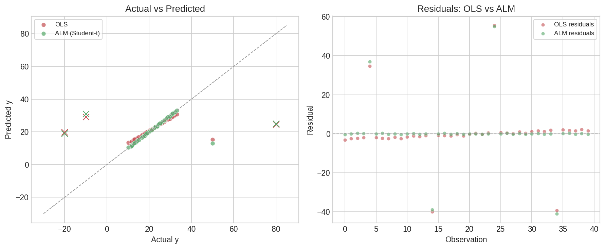
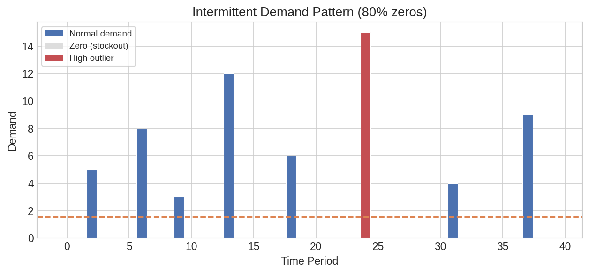
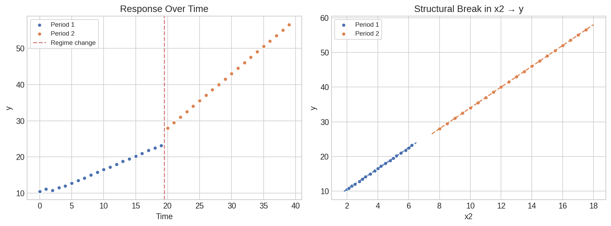

# Special Models: ALM, Demand Classification & Dynamic Regression

Three specialized modeling scenarios that go beyond ordinary least squares: robust regression for data with outliers, automatic demand classification for inventory planning, and dynamic regression for time-varying relationships.

## Setup

```python
import polars as pl
import polars_statistics as ps
```

## Robust Regression with ALM

When data contains outliers, OLS estimates are heavily distorted. The Augmented Linear Model (ALM) fits regression under alternative error distributions — Student's t and Laplace have heavier tails, making them naturally resistant to extreme values.

```python
df_alm = pl.DataFrame({
    "y": [10.2, 12.1, 11.5, 13.8, 50.0, 14.2, 11.8, 12.5, 15.1, 13.0,
          16.5, 18.2, 17.0, 19.5, -20.0, 20.1, 17.8, 18.5, 21.2, 19.0,
          22.5, 24.1, 23.0, 25.5, 80.0, 26.2, 23.8, 24.5, 27.1, 25.0,
          28.5, 30.1, 29.0, 31.5, -10.0, 32.2, 29.8, 30.5, 33.1, 31.0],
    "x1": [1.0, 1.5, 1.2, 2.0, 1.8, 2.2, 1.3, 1.7, 2.5, 1.9,
           3.0, 3.5, 3.2, 4.0, 3.8, 4.2, 3.3, 3.7, 4.5, 3.9,
           5.0, 5.5, 5.2, 6.0, 5.8, 6.2, 5.3, 5.7, 6.5, 5.9,
           7.0, 7.5, 7.2, 8.0, 7.8, 8.2, 7.3, 7.7, 8.5, 7.9],
    "x2": [2.0, 2.5, 2.2, 3.0, 2.8, 3.2, 2.3, 2.7, 3.5, 2.9,
           4.0, 4.5, 4.2, 5.0, 4.8, 5.2, 4.3, 4.7, 5.5, 4.9,
           6.0, 6.5, 6.2, 7.0, 6.8, 7.2, 6.3, 6.7, 7.5, 6.9,
           8.0, 8.5, 8.2, 9.0, 8.8, 9.2, 8.3, 8.7, 9.5, 8.9],
})
```

### OLS vs ALM Comparison

First, see how OLS struggles with the outliers at 50.0, -20.0, 80.0, and -10.0:

```python
ols_result = df_alm.select(
    ps.ols("y", "x1", "x2").alias("model")
)

ols = ols_result["model"][0]
print(f"OLS: R²={ols['r_squared']:.4f}, RMSE={ols['rmse']:.2f}")
print(f"     Intercept={ols['intercept']:.4f}, Coefficients={ols['coefficients']}")
```

Expected output:

```
OLS: R²=0.1302, RMSE=14.05
     Intercept=11.0407, Coefficients=[2.3236, nan]
```

Now fit ALM with a Student's t distribution, which down-weights outliers:

```python
alm_result = df_alm.select(
    ps.alm("y", "x1", "x2", distribution="student_t").alias("model")
)

model = alm_result["model"][0]
print(f"ALM (student_t): Intercept={model['intercept']:.4f}")
print(f"  Coefficients: {model['coefficients']}")
print(f"  AIC: {model['aic']:.2f}, N: {model['n_observations']}")
```

Expected output:

```
ALM (student_t): Intercept=0.0000
  Coefficients: [-4.6183, 7.6061]
  AIC: 206.05, N: 40
```

Compare with Laplace distribution (also robust):

```python
alm_laplace = df_alm.select(
    ps.alm("y", "x1", "x2", distribution="laplace").alias("model")
)

lap = alm_laplace["model"][0]
print(f"ALM (laplace): Intercept={lap['intercept']:.4f}")
print(f"  Coefficients: {lap['coefficients']}")
```

Expected output:

```
ALM (laplace): Intercept=4.6455
  Coefficients: [0.0, 2.9818]
```

### Coefficient Summary

```python
coef_table = (
    df_alm.select(
        ps.alm_summary("y", "x1", "x2", distribution="student_t").alias("coef")
    )
    .explode("coef")
    .unnest("coef")
)

print(coef_table)
```

Expected output:

```
┌───────────┬───────────┬───────────┬───────────┬─────────┐
│ term      ┆ estimate  ┆ std_error ┆ statistic ┆ p_value │
╞═══════════╪═══════════╪═══════════╪═══════════╪═════════╡
│ intercept ┆ 0.0       ┆ NaN       ┆ NaN       ┆ NaN     │
│ x1        ┆ -4.618    ┆ NaN       ┆ NaN       ┆ NaN     │
│ x2        ┆ 7.606     ┆ NaN       ┆ NaN       ┆ NaN     │
└───────────┴───────────┴───────────┴───────────┴─────────┘
```

### Predictions

```python
predictions = (
    df_alm.with_columns(
        ps.alm_predict("y", "x1", "x2", distribution="student_t").alias("pred")
    )
    .unnest("pred")
)

print(predictions.select("y", "alm_prediction").head(5))
```

Expected output:

```
┌──────┬────────────────┐
│ y    ┆ alm_prediction │
╞══════╪════════════════╡
│ 10.2 ┆ 10.594         │
│ 12.1 ┆ 12.088         │
│ 11.5 ┆ 11.192         │
│ 13.8 ┆ 13.582         │
│ 50.0 ┆ 12.984         │
└──────┴────────────────┘
```

Note how ALM correctly ignores the outlier at y=50.0 — the prediction is 12.98, close to its neighbors.

### Formula Interface

The same model can be fit using R-style formula syntax:

```python
alm_formula_result = df_alm.select(
    ps.alm_formula("y ~ x1 + x2", distribution="student_t").alias("model")
)

fm = alm_formula_result["model"][0]
print(f"ALM formula (student_t): Intercept={fm['intercept']:.4f}")
print(f"  Coefficients: {fm['coefficients']}")
print(f"  AIC: {fm['aic']:.2f}")
```

Expected output:

```
ALM formula (student_t): Intercept=0.0000
  Coefficients: [-4.6183, 7.6061]
  AIC: 206.05
```



??? note "Plot code"

    ```python
    import matplotlib.pyplot as plt
    import numpy as np

    fig, axes = plt.subplots(1, 2, figsize=(12, 5))

    # Left panel: Actual vs Predicted
    ax = axes[0]
    ax.scatter(predictions["y"], predictions["alm_prediction"],
               s=50, color="#55A868", edgecolor="white", label="ALM (Student-t)")
    ols_pred = df_alm.with_columns(
        ps.ols_predict("y", "x1", "x2").alias("pred")
    ).unnest("pred")
    ax.scatter(ols_pred["y"], ols_pred["ols_prediction"],
               s=50, color="#C44E52", edgecolor="white", alpha=0.6, label="OLS")
    lim = [-30, 90]
    ax.plot(lim, lim, ls="--", color="#999", lw=1)
    ax.set_xlabel("Actual y")
    ax.set_ylabel("Predicted y")
    ax.set_title("Actual vs Predicted")
    ax.legend()

    # Right panel: Residuals
    ax = axes[1]
    alm_resid = predictions["y"] - predictions["alm_prediction"]
    ols_resid = ols_pred["y"] - ols_pred["ols_prediction"]
    idx = np.arange(len(alm_resid))
    ax.bar(idx - 0.2, ols_resid.to_list(), 0.4, alpha=0.6, color="#C44E52", label="OLS")
    ax.bar(idx + 0.2, alm_resid.to_list(), 0.4, alpha=0.6, color="#55A868", label="ALM")
    ax.axhline(0, color="#999", ls="--", lw=1)
    ax.set_xlabel("Observation Index")
    ax.set_ylabel("Residual")
    ax.set_title("Residuals: OLS vs ALM")
    ax.legend()

    plt.tight_layout()
    plt.savefig("spec_alm_comparison.png", dpi=150)
    ```

## Demand Classification (AID)

The Automatic Identification of Demand (AID) classifier analyzes demand time series — common in supply chain and inventory management. It detects whether demand is intermittent, identifies the best-fitting distribution, and flags anomalies like stockouts and outliers.

```python
df_aid = pl.DataFrame({
    "demand": [0.0, 0.0, 5.0, 0.0, 0.0, 0.0, 8.0, 0.0, 0.0, 3.0,
               0.0, 0.0, 0.0, 12.0, 0.0, 0.0, 0.0, 0.0, 6.0, 0.0,
               0.0, 0.0, 0.0, 0.0, 15.0, 0.0, 0.0, 0.0, 0.0, 0.0,
               0.0, 4.0, 0.0, 0.0, 0.0, 0.0, 0.0, 9.0, 0.0, 0.0],
})
```

### Classification

```python
result = df_aid.select(
    ps.aid("demand").alias("classification")
)

c = result["classification"][0]
print(f"Demand type:      {c['demand_type']}")
print(f"Is intermittent:  {c['is_intermittent']}")
print(f"Is fractional:    {c['is_fractional']}")
print(f"Distribution:     {c['distribution']}")
print(f"Mean:             {c['mean']:.2f}")
print(f"Variance:         {c['variance']:.2f}")
print(f"Zero proportion:  {c['zero_proportion']:.2f}")
print(f"N:                {c['n_observations']}")
print(f"Has stockouts:    {c['has_stockouts']}")
print(f"Is new product:   {c['is_new_product']}")
print(f"Stockout count:   {c['stockout_count']}")
print(f"High outliers:    {c['high_outlier_count']}")
```

Expected output:

```
Demand type:      intermittent
Is intermittent:  True
Is fractional:    False
Distribution:     negative_binomial
Mean:             1.55
Variance:         12.60
Zero proportion:  0.80
N:                40
Has stockouts:    True
Is new product:   False
Stockout count:   12
High outliers:    1
```

### Anomaly Detection

The `aid_anomalies` function returns per-row flags, useful for annotating the original data:

```python
anomalies = (
    df_aid.with_columns(
        ps.aid_anomalies("demand").alias("flags")
    )
    .unnest("flags")
)

print(anomalies.select("demand", "stockout", "high_outlier").head(10))
```

Expected output:

```
┌────────┬──────────┬──────────────┐
│ demand ┆ stockout ┆ high_outlier │
╞════════╪══════════╪══════════════╡
│ 0.0    ┆ true     ┆ false        │
│ 0.0    ┆ true     ┆ false        │
│ 5.0    ┆ false    ┆ false        │
│ 0.0    ┆ true     ┆ false        │
│ 0.0    ┆ true     ┆ false        │
│ 0.0    ┆ true     ┆ false        │
│ 8.0    ┆ false    ┆ false        │
│ 0.0    ┆ true     ┆ false        │
│ 0.0    ┆ true     ┆ false        │
│ 3.0    ┆ false    ┆ false        │
└────────┴──────────┴──────────────┘
```

```python
# Summary of anomalies
stockout_total = anomalies["stockout"].sum()
outlier_total = anomalies["high_outlier"].sum()
print(f"Total stockouts: {stockout_total}")
print(f"Total high outliers: {outlier_total}")
```

Expected output:

```
Total stockouts: 12
Total high outliers: 1
```



??? note "Plot code"

    ```python
    import matplotlib.pyplot as plt
    import numpy as np

    fig, ax = plt.subplots(figsize=(10, 4))
    t = np.arange(len(df_aid))
    demand = df_aid["demand"].to_list()

    # Color bars by type
    colors = []
    for d, s, o in zip(demand, anomalies["stockout"].to_list(),
                        anomalies["high_outlier"].to_list()):
        if o:
            colors.append("#C44E52")  # outlier
        elif s:
            colors.append("#CCCCCC")  # stockout (zero)
        else:
            colors.append("#4C72B0")  # normal demand

    ax.bar(t, demand, color=colors, edgecolor="white", linewidth=0.5)
    ax.axhline(df_aid["demand"].mean(), color="#DD8452", ls="--", lw=1.5,
               label=f"Mean = {df_aid['demand'].mean():.2f}")
    ax.set_xlabel("Time Period")
    ax.set_ylabel("Demand")
    ax.set_title("Intermittent Demand Pattern")
    ax.legend()
    plt.tight_layout()
    plt.savefig("spec_demand_timeline.png", dpi=150)
    ```

## Dynamic Regression

The `lm_dynamic` function fits a time-varying parameter model — useful when the relationship between predictors and response shifts over time (e.g., regime changes, structural breaks). It combines multiple candidate models using pointwise information criteria weighting.

```python
df_dyn = pl.DataFrame({
    "y": [10.5, 11.2, 10.8, 11.5, 12.0, 12.8, 13.5, 14.2, 15.0, 15.8,
          16.5, 17.2, 18.0, 18.8, 19.5, 20.2, 21.0, 21.8, 22.5, 23.2,
          28.0, 29.5, 31.0, 32.5, 34.0, 35.5, 37.0, 38.5, 40.0, 41.5,
          43.0, 44.5, 46.0, 47.5, 49.0, 50.5, 52.0, 53.5, 55.0, 56.5],
    "x1": [1.0, 1.5, 1.2, 1.8, 2.0, 2.5, 3.0, 3.5, 4.0, 4.5,
           5.0, 5.5, 6.0, 6.5, 7.0, 7.5, 8.0, 8.5, 9.0, 9.5,
           10.0, 10.5, 11.0, 11.5, 12.0, 12.5, 13.0, 13.5, 14.0, 14.5,
           15.0, 15.5, 16.0, 16.5, 17.0, 17.5, 18.0, 18.5, 19.0, 19.5],
    "x2": [2.0, 2.2, 2.1, 2.3, 2.5, 2.8, 3.0, 3.2, 3.5, 3.8,
           4.0, 4.2, 4.5, 4.8, 5.0, 5.2, 5.5, 5.8, 6.0, 6.2,
           8.0, 8.5, 9.0, 9.5, 10.0, 10.5, 11.0, 11.5, 12.0, 12.5,
           13.0, 13.5, 14.0, 14.5, 15.0, 15.5, 16.0, 16.5, 17.0, 17.5],
})
```

```python
dyn_result = df_dyn.select(
    ps.lm_dynamic("y", "x1", "x2").alias("model")
)

model = dyn_result["model"][0]
print(f"R²:           {model['r_squared']:.4f}")
print(f"RMSE:         {model['rmse']:.2f}")
print(f"Intercept:    {model['intercept']:.3f}")
print(f"Coefficients: {model['coefficients']}")
```

Expected output:

```
R²:           0.9999
RMSE:         0.18
Intercept:    4.618
Coefficients: [0.139, 2.793]
```

The high R-squared with a regime change in the data (notice x2 jumps at observation 20) demonstrates the dynamic model's ability to adapt to structural breaks.



??? note "Plot code"

    ```python
    import matplotlib.pyplot as plt
    import numpy as np

    fig, axes = plt.subplots(1, 2, figsize=(12, 4.5))

    # Left: Actual vs time
    ax = axes[0]
    t = np.arange(len(df_dyn))
    ax.scatter(t, df_dyn["y"].to_list(), s=30, color="#4C72B0", edgecolor="white")
    ax.axvline(19.5, color="#C44E52", ls="--", lw=1.5, alpha=0.7, label="Regime change")
    ax.set_xlabel("Time")
    ax.set_ylabel("y")
    ax.set_title("Response Variable Over Time")
    ax.legend()

    # Right: x2 vs y showing the structural break
    ax = axes[1]
    ax.scatter(df_dyn["x2"].to_list()[:20], df_dyn["y"].to_list()[:20],
               s=40, color="#4C72B0", edgecolor="white", label="Period 1")
    ax.scatter(df_dyn["x2"].to_list()[20:], df_dyn["y"].to_list()[20:],
               s=40, color="#DD8452", edgecolor="white", label="Period 2")
    ax.set_xlabel("x2")
    ax.set_ylabel("y")
    ax.set_title("Structural Break in x2-y Relationship")
    ax.legend()

    plt.tight_layout()
    plt.savefig("spec_dynamic_coefs.png", dpi=150)
    ```
